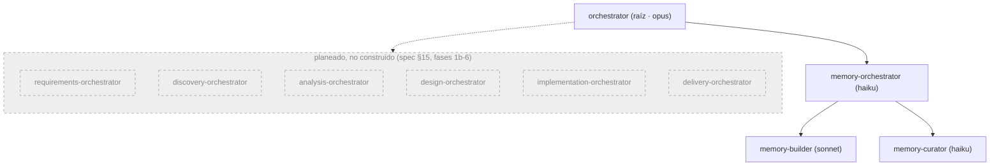
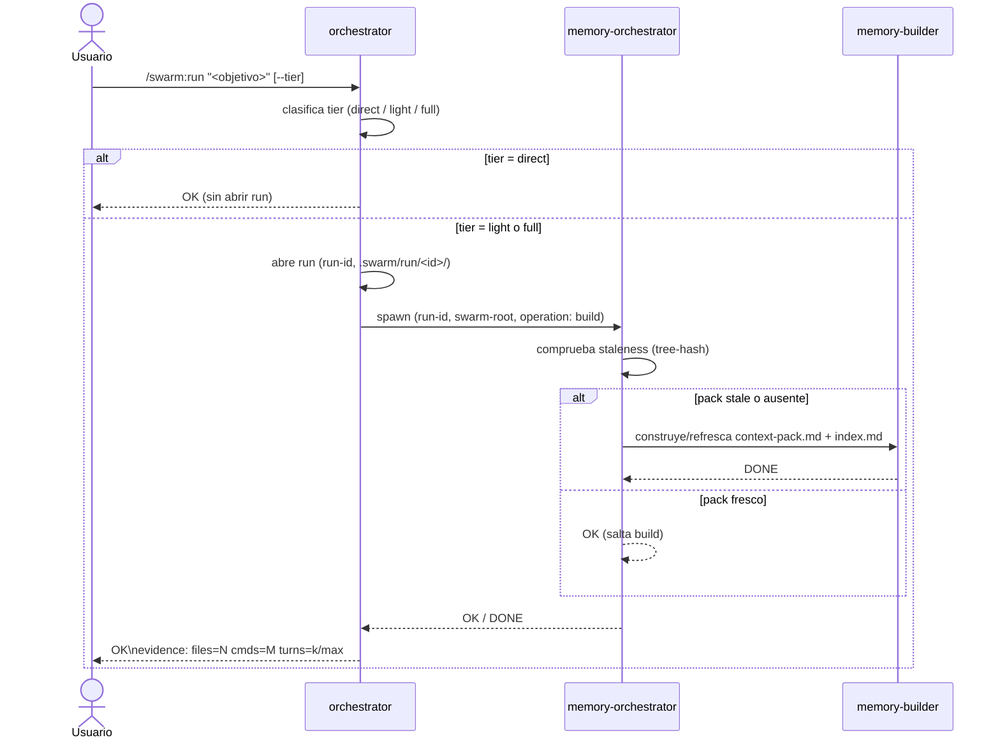
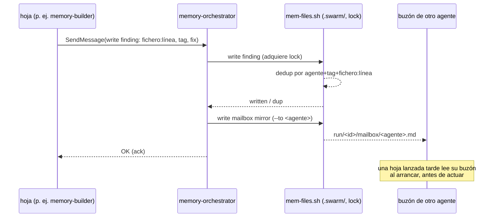

# swarm

Plugin de Claude Code. Enjambre de agentes con responsabilidad única para el ciclo de desarrollo — análisis, diseño, implementación, entrega — optimizado en calidad por token. Diseño completo en `docs/superpowers/specs/2026-09-01-swarm-design.md`. **Solo fase 1 (núcleo) por ahora**: subsistema de memoria + orquestador raíz.

## Instalación

Todavía no hay listing en el marketplace — solo desarrollo local:

```bash
claude --plugin-dir /ruta/a/multiagents
```

## Comandos (fase 1 — núcleo)

- `/swarm:init` — crea `.swarm/` en el repo target, health-gated sobre el backend `files`.
- `/swarm:run <objetivo> [--tier=direct|light|full]` — lanza el orquestador raíz.

## Cómo funciona

### Arquitectura — qué existe vs qué está planeado



El `orchestrator` raíz (opus) clasifica el tier del run y habla con un único dominio hoy: `memory-orchestrator`, que dirige a `memory-builder` (construye/refresca el context-pack) y `memory-curator` (compacta hallazgos, GC). Cualquier otro dominio del diseño — requisitos, discovery, análisis, diseño, implementación, entrega — está especificado pero no implementado (ver estado más abajo).

### Flujo de `/swarm:run`



`direct` nunca abre run ni toca memoria — la raíz responde ella misma. `light`/`full` abren un run y siempre comprueban el pack antes de hacer nada más; el pack solo se reconstruye si está stale (tree-state hash), nunca incondicionalmente.

### Escritura de memoria / buzón



Ningún agente escanea el repo o `.swarm/` dos veces, y ningún agente escribe `.swarm/` directamente — toda escritura (hallazgo, decisión, buzón) pasa por la única instancia de `memory-orchestrator` del run, que serializa escrituras con un lock. Todo `SendMessage` entre hojas también se espeja al buzón del destinatario, así que un hermano lanzado más tarde en el run — o uno al que se dirige antes de existir — igualmente lee lo que se perdió.

## Estado actual — qué está construido vs planeado

Fases según spec §15:

1. **Núcleo (construido).** `orchestrator`, subsistema de memoria (`memory-orchestrator` + `memory-builder` + `memory-curator`, backends `files`/`claude-mem`), skill `swarm-protocol`, hooks (validación del contrato de evidencia + allowlist de bash), `/swarm:init`, smoke tests 1-8.
1b. **Requisitos (construido).** `requirements-orchestrator`, `env-checker`, `req-check.sh`, `requirements.json`, `/swarm:doctor`.
2. **Discovery (planeado).** `discovery-orchestrator` + 4 hojas, integración `AskUserQuestion` en la raíz.
3. **Análisis (planeado).** `analysis-orchestrator` + 6 lentes read-only.
4. **Diseño (planeado).** `design-orchestrator`, `planner`, `pattern-advisor`, `domain-modeler`, integración grill×3.
5. **Implementación (planeado).** 7 agentes + `dependency-auditor`/`dependency-installer` + el stack pack `php-ddd-symfony8`.
6. **Entrega (planeado).** 3 agentes + `/swarm:status`, `/swarm:findings`.

## Convención de nombres

Todo agente lanzado va **nombrado con su rol** — el basename de su tipo, sin sufijos ni variantes (`memory-orchestrator`, y en fases futuras `security-auditor`, `analysis-orchestrator`, …). Esto es lo que permite que agentes pares se manden `SendMessage` entre sí por nombre sin tener que descubrirlo antes, y que el owner se dirija a un agente concreto directamente — "avisa a `memory-builder` cuando termine" — sin que quien lo pide tenga que averiguar quién es. `memory-orchestrator` es el único caso obligatorio hoy: una única instancia nombrada por run (spec §4.5).

## Tests

```bash
bash tests/run.sh
```

## Licencia

MIT © David García Gordo
