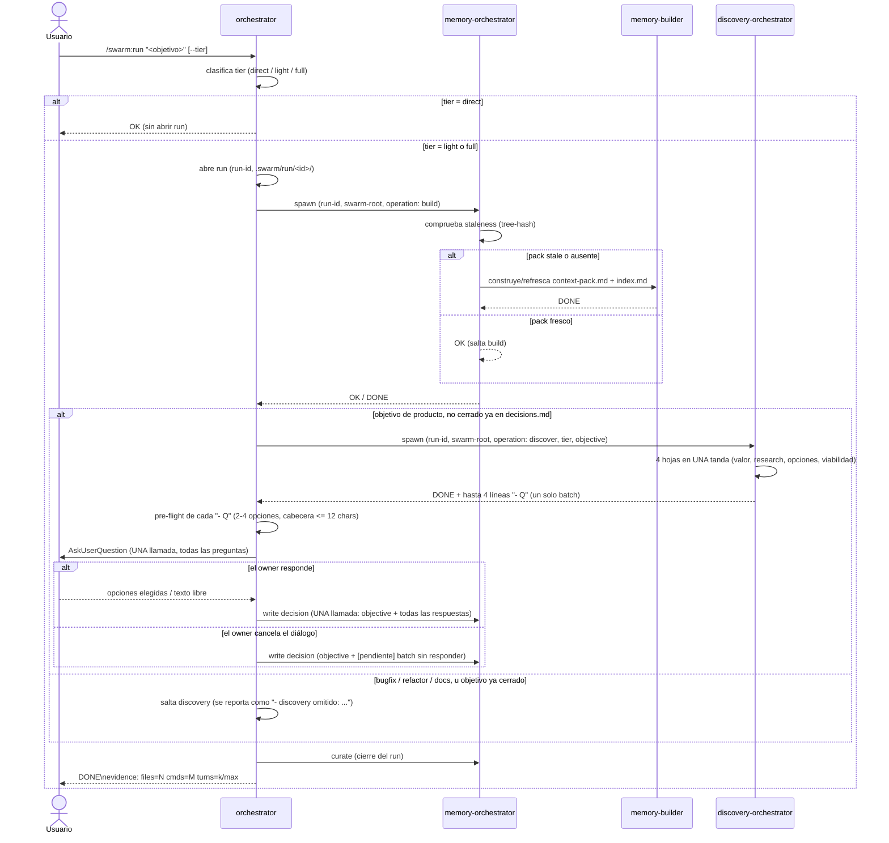
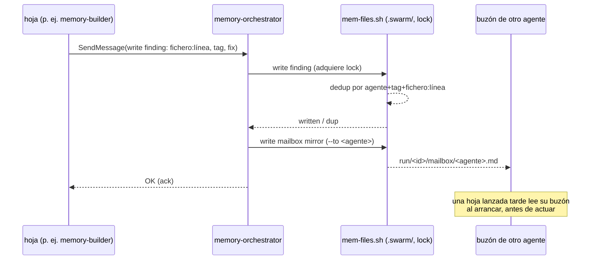

# swarm

Plugin de Claude Code. Enjambre de agentes con responsabilidad única para el ciclo de desarrollo — análisis, diseño, implementación, entrega — optimizado en calidad por token. Diseño completo en `docs/superpowers/specs/2026-09-01-swarm-design.md`. **Construido hasta ahora: fases 1, 1b, 2, 3 y 4** — subsistema de memoria, orquestador raíz, dominio de requisitos, dominio discovery (batch de preguntas presentado al owner con `AskUserQuestion`), dominio de análisis (auditoría read-only del código en 6 lentes) y dominio de diseño (escribe un plan de implementación real, revisado adversarialmente por grill×3, arbitrado por el propio `design-orchestrator`).

## Instalación

Todavía no hay listing en el marketplace — solo desarrollo local:

```bash
claude --plugin-dir /ruta/a/multiagents
```

## Comandos

- `/swarm:init` — crea `.swarm/` en el repo target, health-gated sobre el backend `files`.
- `/swarm:run <objetivo> [--tier=direct|light|full]` — lanza el orquestador raíz.
- `/swarm:doctor` — verifica los requisitos de entorno del repo contra `requirements.json`.

## Cómo funciona

### Arquitectura — qué existe vs qué está planeado

```mermaid
flowchart TD
    O["orchestrator (raíz · opus)"]
    MO["memory-orchestrator (haiku)"]
    MB["memory-builder (sonnet)"]
    MC["memory-curator (haiku)"]
    RO["requirements-orchestrator (haiku)"]
    EC["env-checker (haiku)"]
    DO["discovery-orchestrator (sonnet)"]
    VC["value-critic (opus)"]
    RA["research-analyst (sonnet)"]
    OG["options-generator (opus)"]
    FS["feasibility-spiker (sonnet)"]
    AO["analysis-orchestrator (sonnet)"]
    OA["opportunity-analyst (opus)"]
    AA["architecture-auditor (opus)"]
    SA["security-auditor (opus)"]
    VS["vulnerability-scanner (haiku)"]
    PA["performance-analyst (sonnet)"]
    DMA["data-model-auditor (sonnet)"]
    DGO["design-orchestrator (sonnet)"]
    PADV["pattern-advisor (sonnet)"]
    DM["domain-modeler (opus)"]
    PL["planner (opus)"]

    O --> MO
    MO --> MB
    MO --> MC
    O --> DO
    DO --> VC
    DO --> RA
    DO --> OG
    DO --> FS
    RO --> EC
    O --> AO
    AO --> OA
    AO --> AA
    AO --> SA
    AO --> VS
    AO --> PA
    AO --> DMA
    O --> DGO
    DGO --> PADV
    DGO --> DM
    DGO --> PL

    subgraph planned["planeado, no construido (spec §15, fases 5-6)"]
        direction TB
        IO["implementation-orchestrator"]
        DLO["delivery-orchestrator"]
    end

    O -.-> planned

    classDef planned fill:#eee,stroke:#999,color:#888,stroke-dasharray: 5 5;
    class IO,DLO planned
    class planned planned
```



El `orchestrator` raíz (opus) clasifica el tier del run y habla con cuatro dominios hoy: `memory-orchestrator`, que dirige a `memory-builder` (construye/refresca el context-pack) y `memory-curator` (compacta hallazgos, GC); `discovery-orchestrator`, que dirige las cuatro hojas de discovery y devuelve UN batch de preguntas que la raíz presenta con `AskUserQuestion`; `analysis-orchestrator`, que selecciona un subconjunto de sus 6 lentes read-only según el objetivo y reenvía sus hallazgos directamente; y `design-orchestrator`, que corre tras discovery (solo `tier: full`) — `pattern-advisor` + `domain-modeler` en una tanda, luego `planner` escribe el plan real, luego (también `tier: full`) grill×3 lo revisa adversarialmente y `design-orchestrator` arbitra los hallazgos él mismo, sin preguntar nunca al owner. `requirements-orchestrator` (con `env-checker`) es un quinto dominio, invocado por `/swarm:doctor` y no dentro de un run. Los dominios restantes — implementación, entrega — están especificados pero no implementados (ver estado más abajo).

### Flujo de `/swarm:run`



`direct` nunca abre run ni toca memoria — la raíz responde ella misma. `light`/`full` abren un run y siempre comprueban el pack antes de hacer nada más; el pack solo se reconstruye si está stale (tree-state hash), nunca incondicionalmente.

Con el pack listo, un objetivo **de producto** (nueva funcionalidad, nuevo producto, cambio de comportamiento visible para el usuario) pasa por discovery antes de cualquier diseño: la raíz lanza `discovery-orchestrator`, que corre sus cuatro hojas en una sola tanda y devuelve **un** batch de hasta cuatro preguntas. La raíz valida cada pregunta, las presenta todas en **una** llamada a `AskUserQuestion` — es el único punto en que `/swarm:run` se vuelve interactivo y te espera — y registra todas las respuestas como **una sola** línea de decisión en `.swarm/decisions.md`, con el `objective:` literal delante para que un run posterior sobre el mismo objetivo detecte que discovery ya corrió en vez de volver a preguntar. Si cierras el diálogo sin responder, el batch se registra igualmente, marcado `[pendiente]`. Discovery se salta en bugfixes, refactors, docs, tests e infraestructura, y para un objetivo que `decisions.md` ya cerró; el salto siempre se reporta en la salida.

### Escritura de memoria / buzón



Ningún agente escanea el repo o `.swarm/` dos veces, y ningún agente escribe `.swarm/` directamente — toda escritura (hallazgo, decisión, buzón) pasa por la única instancia de `memory-orchestrator` del run, que serializa escrituras con un lock. Todo `SendMessage` entre hojas también se espeja al buzón del destinatario, así que un hermano lanzado más tarde en el run — o uno al que se dirige antes de existir — igualmente lee lo que se perdió.

## Estado actual — qué está construido vs planeado

Fases según spec §15:

1. **Núcleo (construido).** `orchestrator`, subsistema de memoria (`memory-orchestrator` + `memory-builder` + `memory-curator`, backends `files`/`claude-mem`), skill `swarm-protocol`, hooks (validación del contrato de evidencia + allowlist de bash), `/swarm:init`, smoke tests 1-8.
1b. **Requisitos (construido).** `requirements-orchestrator`, `env-checker`, `req-check.sh`, `requirements.json`, `/swarm:doctor`.
2. **Discovery (construido).** `discovery-orchestrator` + `value-critic`, `research-analyst`, `options-generator`, `feasibility-spiker`; la raíz presenta UN batch de preguntas con `AskUserQuestion` y registra cada respuesta en `.swarm/decisions.md`.
3. **Análisis (construido).** `analysis-orchestrator` + `opportunity-analyst`, `architecture-auditor`, `security-auditor`, `vulnerability-scanner`, `performance-analyst`, `data-model-auditor`; la raíz reenvía sus hallazgos (`TAG · fichero:línea · problema → fix`) directamente, sin `AskUserQuestion` de por medio.
4. **Diseño (construido).** `design-orchestrator` + `pattern-advisor`, `domain-modeler`, `planner`; corre tras discovery en `tier: full`, grill×3 (`working-methods:grill-architect/operator/engineer`) revisa adversarialmente el plan que escribe `planner`, y `design-orchestrator` arbitra los hallazgos él mismo — sin `AskUserQuestion` de por medio.
5. **Implementación (planeado).** 7 agentes + `dependency-auditor`/`dependency-installer` + el stack pack `php-ddd-symfony8`.
6. **Entrega (planeado).** 3 agentes + `/swarm:status`, `/swarm:findings`.

## Ledger de documentación

- 2026-09-03: esta tanda solo cierra el hueco de precisión "construido/planeado" (dominio de diseño
  de fase 4 marcado correctamente arriba, diagrama mermaid actualizado). La petición aparte y
  explícita del owner de una **pasada completa de documentación de uso** (qué es el plugin, cómo se
  instala y cómo se usa cada comando con ejemplos reales) **sigue abierta** — este fix estructural
  no la satisface.

## Convención de nombres

Todo agente lanzado va **nombrado con su rol** — el basename de su tipo, sin sufijos ni variantes (`memory-orchestrator`, `analysis-orchestrator`, y en fases futuras `pattern-advisor`, `dependency-installer`, …). Esto es lo que permite que agentes pares se manden `SendMessage` entre sí por nombre sin tener que descubrirlo antes, y que el owner se dirija a un agente concreto directamente — "avisa a `memory-builder` cuando termine" — sin que quien lo pide tenga que averiguar quién es. `memory-orchestrator` es el único caso obligatorio hoy: una única instancia nombrada por run (spec §4.5).

## Tests

```bash
bash tests/run.sh
```

## Licencia

MIT © David García Gordo
