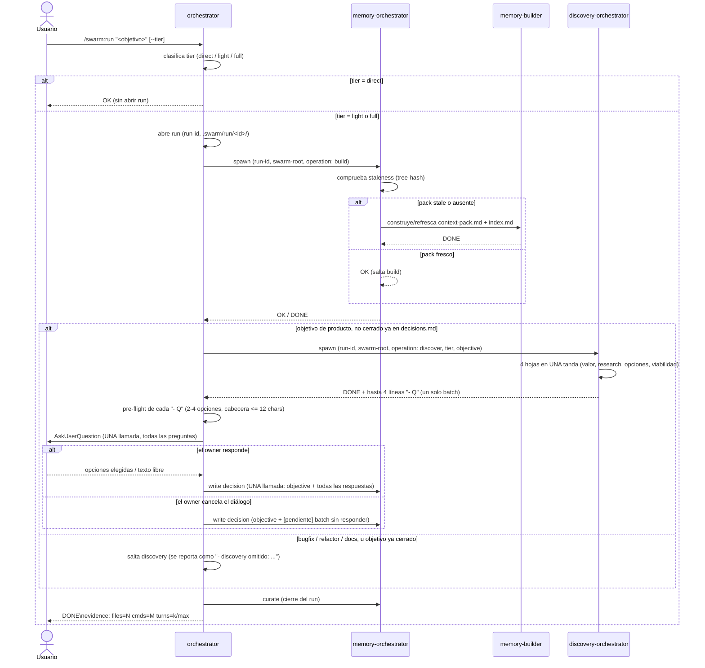
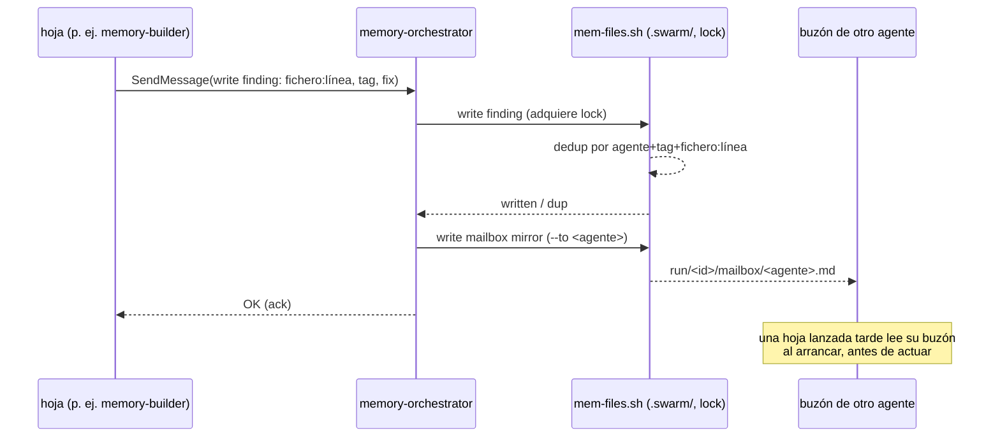

# swarm

Plugin de Claude Code. Enjambre de agentes con responsabilidad única para el ciclo de desarrollo — análisis, diseño, implementación, entrega — optimizado en calidad por token. Diseño completo en `docs/superpowers/specs/2026-09-01-swarm-design.md`. **Construido hasta ahora: fases 1, 1b, 2, 3, 4, 5a, 5b y 6** — subsistema de memoria, orquestador raíz, dominio de requisitos (chequeo de entorno + auditoría de dependencias + instalación aprobada por el owner), dominio discovery (batch de preguntas presentado al owner con `AskUserQuestion`), dominio de análisis (auditoría read-only del código en 7 lentes), dominio de diseño (escribe un plan de implementación real, revisado adversarialmente por grill×3, arbitrado por el propio `design-orchestrator`), dominio de implementación (TDD RED→GREEN por fase en un worktree aislado, con pasos condicionales de migración de esquema y documentación, `reviewer` como gate ANTES del merge local — solo por invocación explícita del owner, nunca encadenado), dominio de entrega (publica una rama ya fusionada — push + PR + handoff — solo por invocación explícita y separada del owner, con gate de `AskUserQuestion` aprobado por el owner que nombra remoto/rama/base, nunca mergea el PR él mismo), y el primer stack pack (`php-ddd-symfony8`, detectado automáticamente desde `composer.json`).

Para una guía de uso completa (instalación, los 5 comandos, cada dominio, ejemplos reales, cómo
interpretar la salida) ver `docs/USAGE.es.md`. Para añadir tu propio stack pack, ver
`docs/EXTENDING-PACKS.es.md`.

## Instalación

Todavía no hay listing en el marketplace — solo desarrollo local:

```bash
claude --plugin-dir /ruta/a/multiagents
```

## Comandos

- `/swarm:init` — crea `.swarm/` en el repo target, health-gated sobre el backend `files`.
- `/swarm:run <objetivo> [--tier=direct|light|full]` — lanza el orquestador raíz.
- `/swarm:doctor` — verifica los requisitos de entorno del repo contra `requirements.json`.
- `/swarm:status` — resumen determinista, sin turno de modelo, del run actual, tier, agentes y hallazgos abiertos.
- `/swarm:findings [agente|TAG] [--all]` — consulta filtrada determinista, sin turno de modelo, de los hallazgos del enjambre.

## Cómo funciona

### Arquitectura

```mermaid
flowchart TD
    O["orchestrator (raíz · opus)"]
    MO["memory-orchestrator (haiku)"]
    MB["memory-builder (sonnet)"]
    MC["memory-curator (haiku)"]
    RO["requirements-orchestrator (haiku)"]
    EC["env-checker (haiku)"]
    DA["dependency-auditor (sonnet)"]
    DI["dependency-installer (sonnet)"]
    DO["discovery-orchestrator (sonnet)"]
    VC["value-critic (opus)"]
    RA["research-analyst (sonnet)"]
    OG["options-generator (opus)"]
    FS["feasibility-spiker (sonnet)"]
    AO["analysis-orchestrator (sonnet)"]
    OA["opportunity-analyst (opus)"]
    AA["architecture-auditor (opus)"]
    SA["security-auditor (opus)"]
    VS["vulnerability-scanner (haiku)"]
    PA["performance-analyst (sonnet)"]
    DMA["data-model-auditor (sonnet)"]
    SOA["solid-auditor (opus)"]
    DGO["design-orchestrator (sonnet)"]
    PADV["pattern-advisor (sonnet)"]
    DM["domain-modeler (opus)"]
    PL["planner (opus)"]
    IO["implementation-orchestrator (sonnet)"]
    TW["test-writer (sonnet)"]
    IM["implementer (sonnet)"]
    ME["migration-engineer (sonnet)"]
    DW["doc-writer (sonnet)"]
    QF["quality-fixer (haiku)"]
    RV["reviewer (opus)"]
    VER["verifier (opus)"]
    DLO["delivery-orchestrator (haiku)"]
    RM["release-manager (sonnet)"]
    HW["handoff-writer (haiku)"]

    O --> MO
    MO --> MB
    MO --> MC
    O --> DO
    DO --> VC
    DO --> RA
    DO --> OG
    DO --> FS
    O -. audit-deps / install .-> RO
    RO --> EC
    RO --> DA
    RO --> DI
    O --> AO
    AO --> OA
    AO --> AA
    AO --> SA
    AO --> VS
    AO --> PA
    AO --> DMA
    AO --> SOA
    O --> DGO
    DGO --> PADV
    DGO --> DM
    DGO --> PL
    O -. solo invocación explícita .-> IO
    IO --> TW
    IO --> IM
    IO --> ME
    IO --> DW
    IO --> QF
    IO --> RV
    O -. gate de verificación, antes de todo cierre en verde .-> VER
    O -. solo invocación explícita, nunca encadenada .-> DLO
    DLO --> RM
    DLO --> HW
```



El `orchestrator` raíz (opus) clasifica el tier del run y habla con siete dominios hoy: `memory-orchestrator`, que dirige a `memory-builder` (construye/refresca el context-pack) y `memory-curator` (compacta hallazgos, GC); `requirements-orchestrator`, que dirige a `env-checker` (chequeo de herramientas OS/proyecto, `operation: check` de `/swarm:doctor`), `dependency-auditor` (auditoría read-only de CVEs/desactualización/licencias, `operation: audit-deps`) y `dependency-installer` (mutante, `operation: install`, lanzado solo con una aprobación itemizada del owner que la raíz recoge vía `AskUserQuestion` — ver `agents/orchestrator.md` §11); `discovery-orchestrator`, que dirige las cuatro hojas de discovery y devuelve UN batch de preguntas que la raíz presenta con `AskUserQuestion`; `analysis-orchestrator`, que selecciona un subconjunto de sus 7 lentes read-only según el objetivo y reenvía sus hallazgos directamente; `design-orchestrator`, que corre tras discovery (solo `tier: full`) — `pattern-advisor` + `domain-modeler` en una tanda, luego `planner` escribe el plan real, luego (también `tier: full`) grill×3 lo revisa adversarialmente y `design-orchestrator` arbitra los hallazgos él mismo, sin preguntar nunca al owner; y `implementation-orchestrator`, que secuencia `test-writer` (RED) → `implementer` (worktree aislado, GREEN) → `migration-engineer` (condicional, solo fases que tocan esquema) → `doc-writer` (condicional, solo fases con cambio de comportamiento observable) → `quality-fixer` (`--fix` determinista + residual) → `reviewer` (gate severidad-tagged ANTES del merge) → merge local a la rama del run, para UNA fase de un plan ya `arbitrado` por invocación — solo cuando el owner lo pide explícitamente, nunca encadenado tras discovery/diseño. `/swarm:doctor` también invoca a `requirements-orchestrator` directamente, en modo adhoc, fuera de cualquier run, para un chequeo de entorno simple. Antes de cualquier cierre en verde de un run — cierre normal, análisis, diseño, implementación, una auditoría/instalación de requisitos o una entrega — la raíz lanza `verifier` (opus, read-only), un gate único y genérico (spec §14bis) que comprueba de forma independiente que el veredicto del dominio que cierra traza a hallazgos realmente persistidos y cumple su propio contrato `## Salida`; un `KO` le da al dominio una oportunidad de corregir, un segundo `KO` cierra el run `BLOCKED` en vez de en falso verde. Y `delivery-orchestrator` (haiku), que secuencia `release-manager` (sonnet — fase A previsualiza los comandos exactos de push/PR, fase B los ejecuta solo con una cabecera `approved-push:` itemizada que la raíz construye a partir de una aprobación real vía `AskUserQuestion`, y `operation: configure-remote` arranca un remoto ausente bajo su propio gate `approved-remote:` separado) y `handoff-writer` (haiku, en cualquier camino terminal) — lanzado solo por una petición explícita y separada del owner que nombre la entrega, nunca encadenado tras implementación, nunca mergeando el PR él mismo (ver `agents/orchestrator.md` §12).

### Flujo de `/swarm:run`



`direct` nunca abre run ni toca memoria — la raíz responde ella misma. `light`/`full` abren un run y siempre comprueban el pack antes de hacer nada más; el pack solo se reconstruye si está stale (tree-state hash), nunca incondicionalmente.

Con el pack listo, un objetivo **de producto** (nueva funcionalidad, nuevo producto, cambio de comportamiento visible para el usuario) pasa por discovery antes de cualquier diseño: la raíz lanza `discovery-orchestrator`, que corre sus cuatro hojas en una sola tanda y devuelve **un** batch de hasta cuatro preguntas. La raíz valida cada pregunta, las presenta todas en **una** llamada a `AskUserQuestion` — es el único punto en que `/swarm:run` se vuelve interactivo y te espera — y registra todas las respuestas como **una sola** línea de decisión en `.swarm/decisions.md`, con el `objective:` literal delante para que un run posterior sobre el mismo objetivo detecte que discovery ya corrió en vez de volver a preguntar. Si cierras el diálogo sin responder, el batch se registra igualmente, marcado `[pendiente]`. Discovery se salta en bugfixes, refactors, docs, tests e infraestructura, y para un objetivo que `decisions.md` ya cerró; el salto siempre se reporta en la salida.

### Escritura de memoria / buzón



Ningún agente escanea el repo o `.swarm/` dos veces, y ningún agente escribe `.swarm/` directamente — toda escritura (hallazgo, decisión, buzón) pasa por la única instancia de `memory-orchestrator` del run, que serializa escrituras con un lock. Todo `SendMessage` entre hojas también se espeja al buzón del destinatario, así que un hermano lanzado más tarde en el run — o uno al que se dirige antes de existir — igualmente lee lo que se perdió.

## Estado actual — qué está construido

Fases según spec §15:

1. **Núcleo (construido).** `orchestrator`, subsistema de memoria (`memory-orchestrator` + `memory-builder` + `memory-curator`, backends `files`/`claude-mem`), skill `swarm-protocol`, hooks (validación del contrato de evidencia + allowlist de bash), `/swarm:init`, smoke tests 1-8.
1b. **Requisitos — chequeo de entorno (construido).** `requirements-orchestrator`, `env-checker`, `req-check.sh`, `requirements.json`, `/swarm:doctor`.
2. **Discovery (construido).** `discovery-orchestrator` + `value-critic`, `research-analyst`, `options-generator`, `feasibility-spiker`; la raíz presenta UN batch de preguntas con `AskUserQuestion` y registra cada respuesta en `.swarm/decisions.md`.
3. **Análisis (construido).** `analysis-orchestrator` + `opportunity-analyst`, `architecture-auditor`, `security-auditor`, `vulnerability-scanner`, `performance-analyst`, `data-model-auditor`, `solid-auditor`; la raíz reenvía sus hallazgos (`TAG · fichero:línea · problema → fix`) directamente, sin `AskUserQuestion` de por medio.
4. **Diseño (construido).** `design-orchestrator` + `pattern-advisor`, `domain-modeler`, `planner`; corre tras discovery en `tier: full`, grill×3 (`working-methods:grill-architect/operator/engineer`) revisa adversarialmente el plan que escribe `planner`, y `design-orchestrator` arbitra los hallazgos él mismo — sin `AskUserQuestion` de por medio.
5. **Implementación — núcleo (construido, fase 5a).** `implementation-orchestrator` + `test-writer`, `implementer`, `quality-fixer`, `reviewer`; ejecuta UNA fase de un plan ya `arbitrado` por invocación (TDD RED→GREEN en el worktree aislado de `implementer`, `quality-fixer` aplica `--fix` al residual, `reviewer` hace gate de hallazgos severidad-tagged ANTES del merge local a la rama del run); solo por invocación explícita del owner, nunca encadenado tras discovery/diseño.
5b. **Requisitos — auditoría/instalación de dependencias + stack pack (construido).** `dependency-auditor` (auditoría read-only de CVEs/desactualización/licencias, `operation: audit-deps` de `requirements-orchestrator`) y `dependency-installer` (mutante, `operation: install`, solo con una aprobación itemizada del owner recogida por la raíz vía `AskUserQuestion` — `agents/orchestrator.md` §11); `migration-engineer` y `doc-writer` se suman a la secuencia de `implementation-orchestrator` (ambos condicionales — fases que tocan esquema y fases con cambio de comportamiento observable, respectivamente); el primer stack pack, `php-ddd-symfony8` (`skills/pack-php-ddd-symfony8/`), detectado automáticamente desde un `composer.json` con requisito `symfony/*`.
6. **Entrega (construido).** `delivery-orchestrator` (secuencia `release-manager` + `handoff-writer`), `release-manager` (gate de push/PR en dos fases — preview de `prepare-release`, `publish-release` solo con una cabecera `approved-push:` itemizada, `configure-remote` arranca un remoto ausente bajo un gate `approved-remote:` separado), `handoff-writer` (handoff de sesión en cualquier camino terminal); gate en la raíz, `agents/orchestrator.md` §12 — solo por invocación explícita y separada del owner, nunca encadenado, nunca mergea el PR él mismo. Más `/swarm:status` y `/swarm:findings` — comandos deterministas, sin turno de modelo, sobre el estado de `.swarm/`.
14bis. **Gate de verificación independiente (construido).** `verifier` (opus, read-only, genérico — sin conocimiento de ningún dominio concreto); la raíz lo lanza antes de todo cierre en verde de cualquier dominio (spec §14bis) para comprobar que las afirmaciones del veredicto que cierra trazan a hallazgos realmente persistidos y que las líneas obligatorias de su propio contrato están presentes; two-strike: un `KO` devuelve el dominio a corregir una vez, un segundo `KO` cierra el run `BLOCKED` en vez de en falso verde.

## Convención de nombres

Todo agente lanzado va **nombrado con su rol** — el basename de su tipo, sin sufijos ni variantes (`memory-orchestrator`, `analysis-orchestrator`, `pattern-advisor`, `dependency-installer`, y en el futuro `release-manager`…). Esto es lo que permite que agentes pares se manden `SendMessage` entre sí por nombre sin tener que descubrirlo antes, y que el owner se dirija a un agente concreto directamente — "avisa a `memory-builder` cuando termine" — sin que quien lo pide tenga que averiguar quién es. `memory-orchestrator` es el único caso obligatorio hoy: una única instancia nombrada por run (spec §4.5).

## Tests

```bash
bash tests/run.sh
```

## Licencia

MIT © David García Gordo
