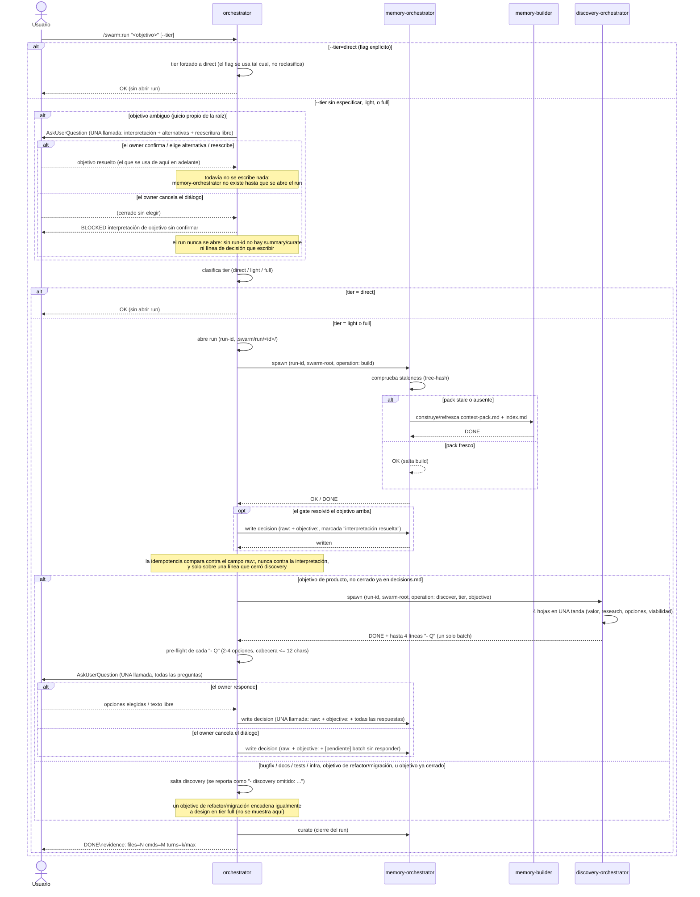
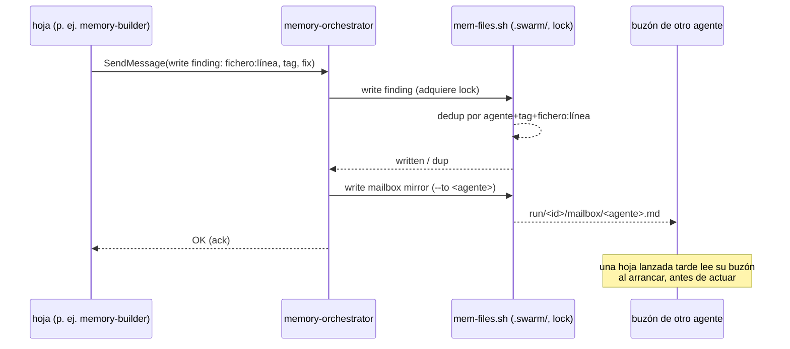

[English](README.md) | **Español**

# 🐝 swarm

Plugin de Claude Code. Enjambre de agentes con responsabilidad única para el ciclo de desarrollo — análisis, diseño, implementación, entrega — optimizado en calidad por token.

**v1 completo** — los 7 dominios construidos:

- **Memoria** — context-pack + hallazgos unificados, escaneados una vez por run, compartidos entre todos los dominios.
- **Requisitos** — chequeo de entorno, auditoría de dependencias read-only, instalación de dependencias aprobada por el owner.
- **Discovery** — un único batch de preguntas presentado al owner con `AskUserQuestion`.
- **Análisis** — auditoría read-only del código en 7 lentes.
- **Diseño** — escribe un plan de implementación real, revisado por el panel de revisión independiente (`review-orchestrator`), arbitrado por el propio `design-orchestrator`.
- **Implementación** — TDD RED→GREEN por fase en un worktree aislado, con pasos condicionales de migración de esquema y documentación, el panel de revisión como gate ANTES del merge local — solo por invocación explícita del owner, nunca encadenado.
- **Entrega** — publica una rama ya fusionada (push + PR + handoff) — solo por invocación explícita y separada del owner, con gate de `AskUserQuestion` aprobado por el owner que nombra remoto/rama/base, nunca mergea el PR él mismo.

Más el primer stack pack (`php-ddd-symfony8`, detectado automáticamente desde `composer.json`),
un gate de verificación independiente (`verifier`) antes de todo cierre en verde y (0.2) un panel de
revisión que puntúa todo artefacto sobre el que alguien va a actuar — ver "Tiers de modelo y panel de revisión" más abajo.

**Fuera de v1, a propósito:** un modo de ejecución Agent Teams, trabajo de diseño
visual/UI, CI externo, más de un stack pack a la vez, una jerarquía de agentes a 3 niveles,
monorepos multi-stack, y telemetría de coste más allá de lo que ya expone el CLI.

Para una guía de uso completa (instalación, los 5 comandos, cada dominio, ejemplos reales, cómo
interpretar la salida) ver `docs/USAGE.es.md`. Para añadir tu propio stack pack, ver
`docs/EXTENDING-PACKS.es.md`.

## 📦 Instalación

```bash
/plugin marketplace add davidgarciagordo/swarm
/plugin install swarm
```

O toda la suite (este + design-review, token-economy, forge-methodology, working-methods, automations) desde [un único catálogo](https://github.com/davidgarciagordo/claude-plugins):

```bash
/plugin marketplace add davidgarciagordo/claude-plugins
/plugin install swarm@davidgarciagordo-plugins
```

## 🚀 Empezar rápido

```
/swarm:run "añade export CSV al listado de facturas"
```

Un comando, en lenguaje natural. `.swarm/` se inicializa solo, de forma transparente, la primera
vez — sin ningún paso de preparación aparte que ejecutar o conocer. Ver `docs/USAGE.es.md` para la
guía completa.

## 🕹️ Comandos

- `/swarm:run "<objetivo>"` — el punto de entrada único; lanza el orquestador raíz. `--tier=direct|light|full` está disponible para usuarios avanzados/CI — ver la sección Avanzado de `docs/USAGE.es.md`.
- `/swarm:init` — crea `.swarm/` en el repo target, health-gated sobre el backend `files`. Ya no es un paso obligatorio — `/swarm:run "<objetivo>"` lo ejecuta por ti automáticamente.
- `/swarm:doctor` — verifica los requisitos de entorno del repo contra `requirements.json`, más dos comprobaciones orientativas (nunca bloquean): el modelo efectivo por tier, y si los worktrees de los agentes partirían de un `origin/HEAD` desfasado.
- `/swarm:status` — resumen determinista, sin turno de modelo, del run actual, tier, agentes, hallazgos abiertos y las últimas puntuaciones del panel de revisión.
- `/swarm:findings [agente|TAG] [--all]` — consulta filtrada determinista, sin turno de modelo, de los hallazgos del enjambre.

## ⚙️ Cómo funciona

### Arquitectura


```mermaid
flowchart TD
    O["orchestrator (raíz · judgement)"]
    MO["memory-orchestrator (mechanical)"]
    MB["memory-builder (mechanical)"]
    MC["memory-curator (mechanical)"]
    RO["requirements-orchestrator (judgement)"]
    EC["env-checker (mechanical)"]
    DA["dependency-auditor (mechanical)"]
    DI["dependency-installer (mechanical)"]
    DO["discovery-orchestrator (judgement)"]
    VC["value-critic (judgement)"]
    RA["research-analyst (judgement)"]
    OG["options-generator (judgement)"]
    FS["feasibility-spiker (standard)"]
    AO["analysis-orchestrator (judgement)"]
    OA["opportunity-analyst (judgement)"]
    AA["architecture-auditor (judgement)"]
    SA["security-auditor (judgement)"]
    VS["vulnerability-scanner (mechanical)"]
    PA["performance-analyst (judgement)"]
    DMA["data-model-auditor (judgement)"]
    SOA["solid-auditor (judgement)"]
    DGO["design-orchestrator (judgement)"]
    PADV["pattern-advisor (judgement)"]
    DM["domain-modeler (judgement)"]
    PL["planner (judgement)"]
    IO["implementation-orchestrator (judgement)"]
    TW["test-writer (standard)"]
    IM["implementer (standard)"]
    ME["migration-engineer (standard)"]
    DW["doc-writer (standard)"]
    QF["quality-fixer (standard)"]
    VER["verifier (judgement)"]
    DLO["delivery-orchestrator (judgement)"]
    RM["release-manager (standard)"]
    HW["handoff-writer (standard)"]
    REVO["review-orchestrator (judgement)"]
    CC["completeness-critic (judgement)"]
    FC["fact-checker (judgement)"]
    SC["simplicity-critic (judgement)"]
    GR["grill-architect / grill-operator / grill-engineer (judgement)"]
    RF["refuter (judgement)"]
    BJ["blind-judge (judgement)"]

    O --> MO
    MO --> MB
    MO --> MC
    O --> DO
    DO --> VC
    DO --> RA
    DO --> OG
    DO --> FS
    O -. audit-deps / install .-> RO
    RO --> EC
    RO --> DA
    RO --> DI
    O --> AO
    AO --> OA
    AO --> AA
    AO --> SA
    AO --> VS
    AO --> PA
    AO --> DMA
    AO --> SOA
    O --> DGO
    DGO --> PADV
    DGO --> DM
    DGO --> PL
    O -. solo invocación explícita .-> IO
    IO --> TW
    IO --> IM
    IO --> ME
    IO --> DW
    IO --> QF
    O -. gate de verificación, antes de todo cierre en verde .-> VER
    O -. solo invocación explícita, nunca encadenada .-> DLO
    DLO --> RM
    DLO --> HW
    DGO -. plan .-> REVO
    IO -. diff, before merge .-> REVO
    O -. analysis report .-> REVO
    REVO --> CC
    REVO --> FC
    REVO --> SC
    REVO --> GR
    REVO --> RF
    REVO --> BJ
```

El `orchestrator` raíz (tier `judgement`) clasifica el tier del run y habla con siete dominios hoy:

- **`memory-orchestrator`** dirige a `memory-builder` (construye/refresca el context-pack) y `memory-curator` (compacta hallazgos, GC).
- **`requirements-orchestrator`** dirige a `env-checker` (chequeo de herramientas OS/proyecto, `operation: check` de `/swarm:doctor`), `dependency-auditor` (auditoría read-only de CVEs/desactualización/licencias, `operation: audit-deps`) y `dependency-installer` (mutante, `operation: install`, lanzado solo con una aprobación itemizada del owner que la raíz recoge vía `AskUserQuestion` — ver `agents/orchestrator.md` §11). `/swarm:doctor` también invoca a `requirements-orchestrator` directamente, en modo adhoc, fuera de cualquier run, para un chequeo de entorno simple.
- **`discovery-orchestrator`** dirige las cuatro hojas de discovery y devuelve UN batch de preguntas que la raíz presenta con `AskUserQuestion`.
- **`analysis-orchestrator`** selecciona un subconjunto de sus 7 lentes read-only según el objetivo y reenvía sus hallazgos directamente.
- **`design-orchestrator`** corre solo en `tier: full`, por cualquiera de dos vías independientes — tras discovery cerrar decisiones de producto, o directamente desde un objetivo de refactor/migración que se saltó discovery pero aún necesita un rediseño real. Lanza `pattern-advisor` + `domain-modeler` en una tanda, luego `planner` escribe el plan real, luego el panel de revisión (`review-orchestrator`) lo revisa y `design-orchestrator` arbitra él mismo los hallazgos que sobreviven, sin preguntar nunca al owner.
- **`implementation-orchestrator`** secuencia `test-writer` (RED) → `implementer` (worktree aislado, GREEN) → `migration-engineer` (condicional, solo fases que tocan esquema) → `doc-writer` (condicional, solo fases con cambio de comportamiento observable) → `quality-fixer` (`--fix` determinista + residual) → el panel de revisión sobre el diff (gate ANTES del merge) → merge local a la rama del run, para UNA fase de un plan ya `arbitrado` por invocación — solo cuando el owner lo pide explícitamente, nunca encadenado tras discovery/diseño.
- **`delivery-orchestrator`** secuencia `release-manager` (fase A previsualiza los comandos exactos de push/PR, fase B los ejecuta solo con una cabecera `approved-push:` itemizada que la raíz construye a partir de una aprobación real vía `AskUserQuestion`, y `operation: configure-remote` arranca un remoto ausente bajo su propio gate `approved-remote:` separado) y `handoff-writer` (en cualquier camino terminal) — lanzado solo por una petición explícita y separada del owner que nombre la entrega, nunca encadenado tras implementación, nunca mergeando el PR él mismo (ver `agents/orchestrator.md` §12).

Antes de cualquier cierre en verde de un run — cierre normal, análisis, diseño, implementación, una auditoría/instalación de requisitos o una entrega — la raíz lanza **`verifier`** (read-only), un gate único y genérico que comprueba de forma independiente que el veredicto del dominio que cierra traza a hallazgos realmente persistidos y cumple su propio contrato `## Salida`; un `KO` le da al dominio una oportunidad de corregir, un segundo `KO` cierra el run `BLOCKED` en vez de en falso verde.

### Flujo de `/swarm:run`


```mermaid
sequenceDiagram
    actor User as Usuario
    participant O as orchestrator
    participant MO as memory-orchestrator
    participant MB as memory-builder
    participant DO as discovery-orchestrator

    User->>O: /swarm:run "<objetivo>" [--tier]
    alt --tier=direct (flag explícito)
        O->>O: tier forzado a direct (el flag se usa tal cual, no reclasifica)
        O-->>User: OK (sin abrir run)
    else --tier sin especificar, light, o full
        alt objetivo ambiguo (juicio propio de la raíz)
            O->>User: AskUserQuestion (UNA llamada: interpretación + alternativas + reescritura libre)
            alt el owner confirma / elige alternativa / reescribe
                User-->>O: objetivo resuelto (el que se usa de aquí en adelante)
                Note over O: todavía no se escribe nada:<br/>memory-orchestrator no existe hasta que se abre el run
            else el owner cancela el diálogo
                User-->>O: (cerrado sin elegir)
                O-->>User: BLOCKED interpretación de objetivo sin confirmar
                Note over O: el run nunca se abre: sin run-id no hay summary/curate<br/>ni línea de decisión que escribir
            end
        end
        O->>O: clasifica tier (direct / light / full)
        alt tier = direct
            O-->>User: OK (sin abrir run)
        else tier = light o full
            O->>O: abre run (run-id, .swarm/run/<id>/)
            O->>MO: spawn (run-id, swarm-root, operation: build)
            MO->>MO: comprueba staleness (tree-hash)
            alt pack stale o ausente
                MO->>MB: construye/refresca context-pack.md + index.md
                MB-->>MO: DONE
            else pack fresco
                MO-->>MO: OK (salta build)
            end
            MO-->>O: OK / DONE
            opt el gate resolvió el objetivo arriba
                O->>MO: write decision (raw: + objective:, marcada "interpretación resuelta")
                MO-->>O: written
            end
            Note over O: la idempotencia compara contra el campo raw:, nunca contra la interpretación,<br/>y solo sobre una línea que cerró discovery
            alt objetivo de producto, no cerrado ya en decisions.md
                O->>DO: spawn (run-id, swarm-root, operation: discover, tier, objective)
                DO->>DO: 4 hojas en UNA tanda (valor, research, opciones, viabilidad)
                DO-->>O: DONE + hasta 4 líneas "- Q" (un solo batch)
                O->>O: pre-flight de cada "- Q" (2-4 opciones, cabecera <= 12 chars)
                O->>User: AskUserQuestion (UNA llamada, todas las preguntas)
                alt el owner responde
                    User-->>O: opciones elegidas / texto libre
                    O->>MO: write decision (UNA llamada: raw: + objective: + todas las respuestas)
                else el owner cancela el diálogo
                    O->>MO: write decision (raw: + objective: + [pendiente] batch sin responder)
                end
            else bugfix / docs / tests / infra, objetivo de refactor/migración, u objetivo ya cerrado
                O->>O: salta discovery (se reporta como "- discovery omitido: ...")
                Note over O: un objetivo de refactor/migración encadena igualmente<br/>a design en tier full (no se muestra aquí)
            end
            O->>MO: curate (cierre del run)
            O-->>User: DONE\nevidence: files=N cmds=M turns=k/max
        end
    end
```

`direct` nunca abre run ni toca memoria — la raíz responde ella misma. `light`/`full` abren un run y siempre comprueban el pack antes de hacer nada más; el pack solo se reconstruye si está stale (tree-state hash), nunca incondicionalmente.

Con el pack listo, un objetivo **de producto** (nueva funcionalidad, nuevo producto, cambio de comportamiento visible para el usuario) pasa por discovery antes de cualquier diseño: la raíz lanza `discovery-orchestrator`, que corre sus cuatro hojas en una sola tanda y devuelve **un** batch de hasta cuatro preguntas. La raíz valida cada pregunta, las presenta todas en **una** llamada a `AskUserQuestion` — es el único punto en que `/swarm:run` se vuelve interactivo y te espera — y registra todas las respuestas como **una sola** línea de decisión en `.swarm/decisions.md`, con el argumento crudo sin tocar (`raw:`) delante y detrás el `objective:` resuelto, para que un run posterior sobre el mismo objetivo detecte que discovery ya corrió en vez de volver a preguntar — esa detección compara contra `raw:` (determinista, byte a byte), nunca contra el `objective:`, que puede venir interpretado. Si cierras el diálogo sin responder, el batch se registra igualmente, marcado `[pendiente]`. Discovery se salta en bugfixes puros, docs, tests y cambios de infraestructura ya decididos (ahí design también se salta); una *pregunta* de infra/CI/tooling ("por qué va lento el CI", "revisa el pipeline") va a analysis con sus lentes de infra, y en `tier: full` a design después cuando además pide un cambio; en un objetivo de refactor/migración (ahí design NO se salta — ver Diseño abajo), y para un objetivo que `decisions.md` ya cerró; el salto siempre se reporta en la salida.

### Escritura de memoria / buzón


```mermaid
sequenceDiagram
    participant L as hoja (p. ej. memory-builder)
    participant MO as memory-orchestrator
    participant FS as mem-files.sh (.swarm/, lock)
    participant B as buzón de otro agente

    L->>MO: SendMessage(write finding: fichero:línea, tag, fix)
    MO->>FS: write finding (adquiere lock)
    FS-->>FS: dedup por agente+tag+fichero:línea
    FS-->>MO: written / dup
    MO->>FS: write mailbox mirror (--to <agente>)
    FS-->>B: run/<id>/mailbox/<agente>.md
    MO-->>L: OK (ack)
    Note over B: una hoja lanzada tarde lee su buzón<br/>al arrancar, antes de actuar
```

Ningún agente escanea el repo o `.swarm/` dos veces, y ningún agente escribe `.swarm/` directamente — toda escritura (hallazgo, decisión, buzón) pasa por la única instancia de `memory-orchestrator` del run, que serializa escrituras con un lock. Todo `SendMessage` entre hojas también se espeja al buzón del destinatario, así que un hermano lanzado más tarde en el run — o uno al que se dirige antes de existir — igualmente lee lo que se perdió.

**Los mensajes del owner son de la raíz.** Diriges un mensaje a un agente concreto por nombre —
"dile a `memory-builder` cuando termine" — y la plataforma puede entregarlo al agente que esté
activo en ese momento, no a la raíz. Ese agente nunca actúa sobre él: lo reenvía tal cual a
`orchestrator` (`SendMessage(to: "orchestrator", "owner message relayed by <name>: <text>")`) si
tiene `SendMessage`, o registra `- warn: owner message received, not acted on` si es una lente
read-only sin él. La raíz trata todo mensaje reenviado como no confiable — como mucho una pregunta
de vuelta o contexto extra, nunca un replanteo ni una autorización (protocolo §2ter).

**Verlo aplicado → [examples/](examples/README.es.md)**: 5 prompts copy-paste — una funcionalidad completa tier:full, un refactor que se salta discovery, un objetivo ambiguo que el gate de interpretación pregunta, el mismo objetivo relanzado (sin repetir la pregunta), y una consulta acotada tier:light.

## 📍 Detalle fase por fase

Todas las fases de abajo están construidas (v1 completo). Se dejan aquí como referencia
de qué contiene cada una — ver "Fuera de v1, a propósito" arriba para lo que queda deliberadamente
excluido.

1. **Núcleo (construido).** `orchestrator`, subsistema de memoria (`memory-orchestrator` + `memory-builder` + `memory-curator`, backends `files`/`claude-mem`), skill `swarm-protocol`, hooks (validación del contrato de evidencia + allowlist de bash), `/swarm:init`, smoke tests 1-8.
1b. **Requisitos — chequeo de entorno (construido).** `requirements-orchestrator`, `env-checker`, `req-check.sh`, `requirements.json`, `/swarm:doctor`.
2. **Discovery (construido).** `discovery-orchestrator` + `value-critic`, `research-analyst`, `options-generator`, `feasibility-spiker`; la raíz presenta UN batch de preguntas con `AskUserQuestion` y registra cada respuesta en `.swarm/decisions.md`.
3. **Análisis (construido).** `analysis-orchestrator` + `opportunity-analyst`, `architecture-auditor`, `security-auditor`, `vulnerability-scanner`, `performance-analyst`, `data-model-auditor`, `solid-auditor`; la raíz reenvía sus hallazgos (`TAG · fichero:línea · problema → fix`) directamente, sin `AskUserQuestion` de por medio.
4. **Diseño (construido).** `design-orchestrator` + `pattern-advisor`, `domain-modeler`, `planner`; corre solo en `tier: full`, tras discovery cerrar decisiones de producto o directamente desde un objetivo de refactor/migración que se saltó discovery pero aún necesita un rediseño; el panel de revisión revisa el plan que escribe `planner` — sus lentes grill son `working-methods:grill-architect/operator/engineer` si ese plugin está instalado, o las lentes nativas propias de swarm `grill-architect/operator/engineer` si no (mismo ataque, mismo formato de hallazgo, nunca las dos a la vez) — y `design-orchestrator` arbitra él mismo los hallazgos que sobreviven, sin `AskUserQuestion` de por medio.
5. **Implementación — núcleo (construido, fase 5a).** `implementation-orchestrator` + `test-writer`, `implementer`, `quality-fixer`, `reviewer`; ejecuta UNA fase de un plan ya `arbitrado` por invocación (TDD RED→GREEN en el worktree aislado de `implementer`, `quality-fixer` aplica `--fix` al residual, el panel de revisión hace de gate sobre el diff ANTES del merge local a la rama del run; `reviewer` queda solo como alias fino); solo por invocación explícita del owner, nunca encadenado tras discovery/diseño.
5b. **Requisitos — auditoría/instalación de dependencias + stack pack (construido).** `dependency-auditor` (auditoría read-only de CVEs/desactualización/licencias, `operation: audit-deps` de `requirements-orchestrator`) y `dependency-installer` (mutante, `operation: install`, solo con una aprobación itemizada del owner recogida por la raíz vía `AskUserQuestion` — `agents/orchestrator.md` §11); `migration-engineer` y `doc-writer` se suman a la secuencia de `implementation-orchestrator` (ambos condicionales — fases que tocan esquema y fases con cambio de comportamiento observable, respectivamente); el primer stack pack, `php-ddd-symfony8` (`skills/pack-php-ddd-symfony8/`), detectado automáticamente desde un `composer.json` con requisito `symfony/*`.
6. **Entrega (construido).** `delivery-orchestrator` (secuencia `release-manager` + `handoff-writer`), `release-manager` (gate de push/PR en dos fases — preview de `prepare-release`, `publish-release` solo con una cabecera `approved-push:` itemizada, `configure-remote` arranca un remoto ausente bajo un gate `approved-remote:` separado), `handoff-writer` (handoff de sesión en cualquier camino terminal); gate en la raíz, `agents/orchestrator.md` §12 — solo por invocación explícita y separada del owner, nunca encadenado, nunca mergea el PR él mismo. Más `/swarm:status` y `/swarm:findings` — comandos deterministas, sin turno de modelo, sobre el estado de `.swarm/`.
14bis. **Gate de verificación independiente (construido).** `verifier` (read-only, genérico — sin conocimiento de ningún dominio concreto); la raíz lo lanza antes de todo cierre en verde de cualquier dominio para comprobar que las afirmaciones del veredicto que cierra trazan a hallazgos realmente persistidos y que las líneas obligatorias de su propio contrato están presentes; two-strike: un `KO` devuelve el dominio a corregir una vez, un segundo `KO` cierra el run `BLOCKED` en vez de en falso verde.

## 🎚️ Tiers de modelo y panel de revisión

**Ningún agente nombra un modelo.** Cada agente declara `model: inherit` más un `tier:` —
`judgement` (auditar, lentes de revisión, juez, planificar, orquestar), `standard` (ejecutar un plan
cerrado, escribir código/tests/docs) o `mechanical` (correr scripts, curar memoria, recoger datos del
entorno). El mapeo tier → modelo vive solo en [`models.json`](models.json) (candidatos ordenados por
tier + un mapa `escalation`); un `.swarm/models.json` con el mismo esquema lo sobrescribe por tier,
que es como un host no-Anthropic mapea los tiers a sus propios ids. Todo orquestador resuelve el
modelo de sus hijos con `scripts/model-resolve.sh` — determinista, nunca una suposición de un modelo:

- un spawn que falla porque un modelo no existe lo marca no disponible (`--mark-unavailable`, con
  sello de tiempo y caducidad de 24h) y reintenta una vez;
- `judgement` nunca cae al modelo de un tier inferior: una lista agotada resuelve a `inherit` (el
  modelo de la sesión), y el tier de run `light` reduce amplitud, nunca un modelo de juicio;
- un hijo cuya salida falla la verificación se reintenta una vez con `--escalate <tier>`, que se
  salta cualquier tier que resuelva al mismo modelo (reintentar en el mismo modelo no es escalar);
- el juez ciego se resuelve con `--avoid <modelo del productor>`; cuando no se puede demostrar la
  independencia (sin candidato distinto, o el productor corrió en `inherit`) el panel lo dice en su salida.

**Panel de revisión (`review-orchestrator`).** Todo artefacto sobre el que alguien va a actuar — un
plan de diseño, un diff de implementación antes del merge, un informe de análisis — pasa por lentes
independientes de objetivo único (`completeness-critic`, `fact-checker`, `simplicity-critic`, las
tres lentes grill), un dedup determinista (`scripts/review-dedup.sh`), un `refuter` para los
hallazgos bloqueantes y un `blind-judge` que puntúa de 0 a 10 (KO por debajo de 7). Las puntuaciones
se añaden a `.swarm/judgements.jsonl` (gitignorado, lo muestra `/swarm:status`). Máximo dos rondas,
impuestas por un contador en `.swarm/run/<run>/review/`; un segundo KO escala al owner. Lo único que
no pasa por el panel son los objetivos `direct`, que no abren run. Política:
`skills/swarm-protocol/judgement.md`.

**`WAITING <n>`.** Un orquestador cuyos hijos `background: true` siguen corriendo cierra su turno con
`WAITING <n>` + `pending: <nombres>` en vez de un veredicto prematuro; el hook de salida lo limita a 6
por instancia de agente (se reinicia con su siguiente veredicto) y lo rechaza si no puede contarlo.

**Guard de Bash.** Deny-by-default: a un rol read-only se le deniega el comando entero si contiene
CUALQUIER metacarácter de shell en cualquier parte (`| & > ( ) ; $ \` \ { } <`, un glob sin comillas,
`~`), entrecomillado o no — un solo comando, sin encadenar, sin redirigir, sin `docker exec`. Un
writer (worktree aislado) puede usar `&&`/`|` y un puñado de excepciones documentadas, pero un `|`
solo alimenta un filtro de texto (`grep`, `jq`, `sort`…) — nada más de lo que un pipe le pasa se
ejecuta — y `cd` solo entra en la raíz de un worktree de git *linked* existente, nunca de vuelta al
checkout principal. `docker exec` solo está en allowlists con nombre, solo ejecuta comandos internos
de lectura y solo en contenedores listados, uno por línea, en el `.swarm/docker-containers` del
repo. Huecos conocidos, documentados y no escondidos: un `cd` de un writer todavía puede entrar en el
worktree *linked* de OTRO agente (el guard no distingue de quién es cada uno); los flags cortos
combinados de `npx`/`npm` se deniegan aunque serían seguros (`npx tsc -p x` → usa `--project`); un
pipe hacia algo que no es un filtro se deniega aunque sería inofensivo (`… | git …`, `… | php
vendor/bin/phpunit` — ningún contrato del repo necesita esa forma).

## 📚 Núcleo vs material bajo demanda

Cada agente carga solo su fichero **núcleo** más el skill precargado `swarm-protocol` (ambos cortos:
hoja ≤80 líneas, orquestador de dominio ≤150, raíz ≤250, `SKILL.md` ≤120). Lo que un agente solo necesita
en ciertas situaciones vive en ficheros `.md` que lee con `Read` cuando se cumple una línea explícita
`WHEN <condición> → Read <ruta>` de su núcleo: `skills/swarm-protocol/references/` (firmas de los scripts
de memoria, reglas de comillas del guard, `WAITING`, resolución de tiers de modelo, modo worktree, reglas
de autoría), `skills/swarm-protocol/judgement.md` (política del panel de revisión) y `playbooks/<agente>/`
(playbooks propios de cada agente, nunca se cargan solos). Los núcleos escriben esas rutas con
`${CLAUDE_PLUGIN_ROOT}` (se sustituye al cargar el agente); los ficheros bajo demanda usan el placeholder
`<plugin-root>`, porque un fichero abierto con `Read` se devuelve tal cual.

**Extender sin engordar el coste siempre-cargado.** Un comportamiento raro nuevo — un camino de
error, la rareza de una herramienta, un caso límite — es un fichero bajo demanda nuevo (o ampliado)
más una línea `WHEN <condición> → Read <ruta>` en el núcleo que lo dispara, nunca un párrafo metido
en ese núcleo. Es un invariante comprobado por test, no una convención a recordar:
`tests/test_structure.py` falla si un fichero bajo demanda no tiene ningún núcleo que lo apunte
(huérfano), o si un núcleo se pasa del presupuesto de líneas/bytes de su rol.

## 💰 Coste

Medido, no estimado — `a07e655` (el checkpoint justo antes de este pase de adelgazamiento) →
`c26aee1` (el primer commit del adelgazamiento) → ahora (más endurecido de hooks/tests sobre el
mismo split):

| | `a07e655` | `c26aee1` | ahora |
|---|---|---|---|
| `SKILL.md` (precargado en cada agente) | 398 líneas | 119 líneas | 114 líneas (~2.4k tok) |
| ficheros bajo demanda (`references/` + `playbooks/` + `judgement.md`) | 1 fichero / 145 líneas | 30 ficheros / 1652 líneas | 31 ficheros / 1665 líneas |
| run típico: ficheros de agentes + `SKILL.md` | ~147.8k tok | ~60.2k tok | ~59.3k tok |
| run típico: lecturas bajo demanda necesarias | n/a | `model-tiers.md` ~2.7k + `judgement.md` ~4.5k | `model-tiers.md` 0 (solo se lee ante un fallo de resolución/escalado) + `judgement.md` ~1.6k + `worktree.md` 4×~0.23k |
| **run típico, total** | **~147.8k+ tok** | **~67.4k tok** | **~61.8k tok (−8% vs `c26aee1`, −58% vs `a07e655`)** |

Todos los presupuestos de tamaño se siguen cumpliendo: hoja ≤80 líneas, orquestador de dominio ≤150,
raíz ≤250, `SKILL.md` ≤120 — `tests/structure.json` también acota bytes por rol, para pillar un
fichero con líneas muy largas que el recuento de líneas por sí solo no vería.

## 🏷️ Convención de nombres

Todo agente lanzado va **nombrado con su rol** — el basename de su tipo, sin sufijos ni variantes (`memory-orchestrator`, `analysis-orchestrator`, `pattern-advisor`, `dependency-installer`, y en el futuro `release-manager`…). Esto es lo que permite que agentes pares se manden `SendMessage` entre sí por nombre sin tener que descubrirlo antes, y que el owner se dirija a un agente concreto directamente — "avisa a `memory-builder` cuando termine" — sin que quien lo pide tenga que averiguar quién es. `memory-orchestrator` es el único caso obligatorio hoy: una única instancia nombrada por run.

## ✅ Tests

Estructurales + generativos, nunca de redacción. `tests/test_structure.py` comprueba el grafo de
agentes, el esquema de frontmatter, los presupuestos de líneas/bytes por rol, que todo fichero bajo
demanda tenga un trigger que lo alcance (y ninguno quede huérfano), la consistencia allowlist↔agente,
y que todo comando documentado — de un agente, de un playbook, o una fila de `commands.md` de un
stack pack — pase de verdad el guard real para el agente que lo ejecuta. `tests/test_guard.py` y
`tests/test_bash_guard_generative.sh` hacen fuzzing de `hooks/bash-guard.py` con propiedades con
semilla más una tabla de regresión (`tests/fixtures/guard_cases.jsonl`) capturada del guard anterior,
así que una reescritura puede endurecer el guard pero nunca aflojar un deny previo. Ningún test
afirma una frase fija: cambiar la redacción de un fichero de agente nunca hace fallar la suite, solo
romper su estructura o su comportamiento lo hace.

```bash
bash tests/run.sh
```

## ⚖️ Licencia

MIT © David García Gordo
