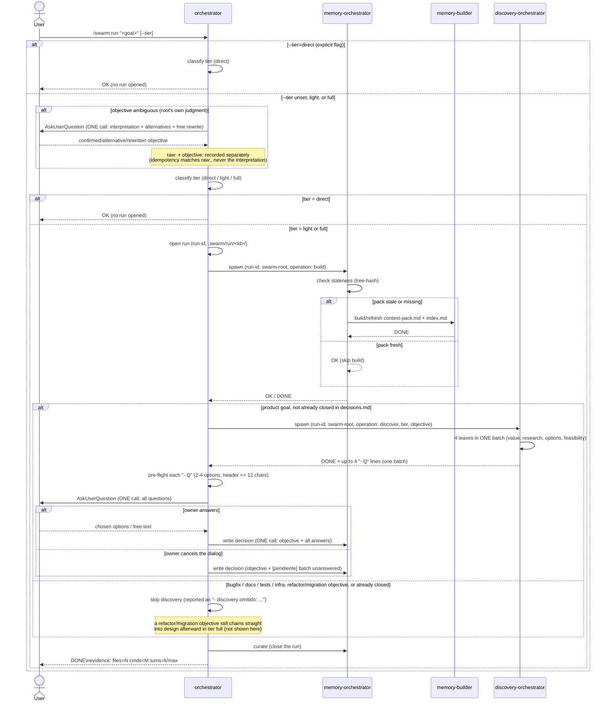
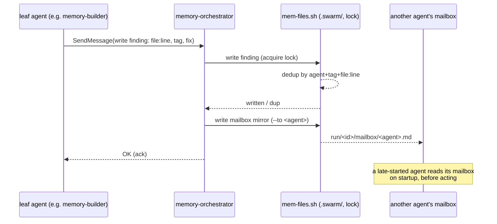

# swarm

Claude Code plugin. Single-responsibility agent swarm for the software development lifecycle — analysis, design, implementation, delivery — optimized for quality per token. Full design in `docs/superpowers/specs/2026-09-01-swarm-design.md`. **Built so far: phases 1, 1b, 2, 3, 4, 5a, 5b and 6** — memory subsystem, root orchestrator, requirements domain (environment check + dependency audit + owner-approved dependency install), discovery domain (questions batch presented to the owner via `AskUserQuestion`), analysis domain (read-only codebase audit across 7 lenses), design domain (writes a real implementation plan, adversarially reviewed by grill×3, arbitrated by `design-orchestrator` itself), implementation domain (RED→GREEN TDD per phase in an isolated worktree, with conditional schema-migration and documentation steps, gated by `reviewer` BEFORE a local merge — only by explicit owner invocation, never auto-chained), delivery domain (publishes an already-merged branch — push + PR + handoff — only by explicit, separate owner invocation, gated by an owner-approved `AskUserQuestion` that names remote/branch/base, never merges the PR itself), and the first stack pack (`php-ddd-symfony8`, auto-detected from `composer.json`).

For a full usage guide (installation, the 5 commands, every domain, worked examples, how to read
the output) see `docs/USAGE.md`. To add a stack pack of your own, see `docs/EXTENDING-PACKS.md`.

## Install

No marketplace listing yet — local dev only:

```bash
claude --plugin-dir /path/to/multiagents
```

## Commands

- `/swarm:init` — creates `.swarm/` in the target repo, health-gated on the `files` backend.
- `/swarm:run <goal> [--tier=direct|light|full]` — launches the root orchestrator.
- `/swarm:doctor` — checks the repo's environment requirements against `requirements.json`.
- `/swarm:status` — deterministic, no-model-turn summary of the current run, tier, agents, and open findings.
- `/swarm:findings [agent|TAG] [--all]` — deterministic, no-model-turn filtered read of the swarm's findings.

## How it works

### Architecture

```mermaid
flowchart TD
    O["orchestrator (root · opus)"]
    MO["memory-orchestrator (haiku)"]
    MB["memory-builder (sonnet)"]
    MC["memory-curator (haiku)"]
    RO["requirements-orchestrator (haiku)"]
    EC["env-checker (haiku)"]
    DA["dependency-auditor (sonnet)"]
    DI["dependency-installer (sonnet)"]
    DO["discovery-orchestrator (sonnet)"]
    VC["value-critic (opus)"]
    RA["research-analyst (sonnet)"]
    OG["options-generator (opus)"]
    FS["feasibility-spiker (sonnet)"]
    AO["analysis-orchestrator (sonnet)"]
    OA["opportunity-analyst (opus)"]
    AA["architecture-auditor (opus)"]
    SA["security-auditor (opus)"]
    VS["vulnerability-scanner (haiku)"]
    PA["performance-analyst (sonnet)"]
    DMA["data-model-auditor (sonnet)"]
    SOA["solid-auditor (opus)"]
    DGO["design-orchestrator (sonnet)"]
    PADV["pattern-advisor (sonnet)"]
    DM["domain-modeler (opus)"]
    PL["planner (opus)"]
    IO["implementation-orchestrator (sonnet)"]
    TW["test-writer (sonnet)"]
    IM["implementer (sonnet)"]
    ME["migration-engineer (sonnet)"]
    DW["doc-writer (sonnet)"]
    QF["quality-fixer (haiku)"]
    RV["reviewer (opus)"]
    VER["verifier (opus)"]
    DLO["delivery-orchestrator (haiku)"]
    RM["release-manager (sonnet)"]
    HW["handoff-writer (haiku)"]

    O --> MO
    MO --> MB
    MO --> MC
    O --> DO
    DO --> VC
    DO --> RA
    DO --> OG
    DO --> FS
    O -. audit-deps / install .-> RO
    RO --> EC
    RO --> DA
    RO --> DI
    O --> AO
    AO --> OA
    AO --> AA
    AO --> SA
    AO --> VS
    AO --> PA
    AO --> DMA
    AO --> SOA
    O --> DGO
    DGO --> PADV
    DGO --> DM
    DGO --> PL
    O -. explicit invocation only .-> IO
    IO --> TW
    IO --> IM
    IO --> ME
    IO --> DW
    IO --> QF
    IO --> RV
    O -. verify gate, before every green close .-> VER
    O -. explicit invocation only, never auto-chained .-> DLO
    DLO --> RM
    DLO --> HW
```



The root `orchestrator` (opus) classifies the run tier and talks to seven domains today: `memory-orchestrator`, which owns `memory-builder` (builds/refreshes the context-pack) and `memory-curator` (compacts findings, GC); `requirements-orchestrator`, which owns `env-checker` (OS/project tool check, `/swarm:doctor`'s `operation: check`), `dependency-auditor` (read-only CVE/outdated/license audit, `operation: audit-deps`) and `dependency-installer` (mutating, `operation: install`, launched only with an itemised owner approval the root collects via `AskUserQuestion` — see `agents/orchestrator.md` §11); `discovery-orchestrator`, which owns the four discovery leaves and returns ONE batch of questions the root presents with `AskUserQuestion`; `analysis-orchestrator`, which selects a subset of its 7 read-only lenses by objective and forwards their findings directly; `design-orchestrator`, which runs in `tier: full` only, via either of two independent paths — after discovery closes product decisions, or directly from a refactor/migration objective that skipped discovery but still needs a real redesign — `pattern-advisor` + `domain-modeler` in one batch, then `planner` writes the real plan file, then grill×3 adversarially reviews it and `design-orchestrator` arbitrates the findings itself, never asking the owner; and `implementation-orchestrator`, which sequences `test-writer` (RED) → `implementer` (isolated worktree, GREEN) → `migration-engineer` (conditional, schema-touching phases only) → `doc-writer` (conditional, observable-behavior phases only, turns allowing) → `quality-fixer` (deterministic `--fix` + residual) → `reviewer` (severity-tagged gate BEFORE merge) → a local merge to the run's branch, for ONE phase of an already-arbitrado plan per invocation — only when the owner asks explicitly, never auto-chained after discovery/design. `/swarm:doctor` also invokes `requirements-orchestrator` directly, adhoc, outside any run, for a plain environment check. Before any green close of a run — normal close, analysis, design, implementation, a requirements audit/install, or a delivery publish — the root launches `verifier` (opus, read-only), a single generic gate (spec §14bis) that independently checks the closing domain's verdict traces to real persisted findings and satisfies its own `## Salida` contract; a `KO` sends the domain one chance to correct, a second `KO` closes the run `BLOCKED` instead of in a false green. And `delivery-orchestrator` (haiku), which sequences `release-manager` (sonnet — phase A previews the exact push/PR commands, phase B executes them only with an itemised `approved-push:` header the root builds from a real `AskUserQuestion` approval, and `operation: configure-remote` bootstraps a missing remote under its own separate `approved-remote:` gate) and `handoff-writer` (haiku, on every terminal path) — launched only by an explicit, separate owner request naming delivery, never auto-chained after implementation, never merging the PR itself (see `agents/orchestrator.md` §12).

### `/swarm:run` flow



`direct` never opens a run and never touches memory — the root answers itself. `light`/`full` open a run and always check the pack before doing anything else; the pack is only rebuilt when stale (tree-state hash), never unconditionally.

Once the pack is ready, a **product** goal (new feature, new product, user-visible behavior change) goes through discovery before any design: the root spawns `discovery-orchestrator`, which runs its four leaves in a single batch and returns **one** batch of up to four questions. The root validates each question, presents them all in **one** `AskUserQuestion` call — so this is the one point where `/swarm:run` becomes interactive and waits for you — and records every answer as a **single** decision line in `.swarm/decisions.md`, prefixed with the literal `objective:` so a later run over the same goal detects that discovery already ran instead of asking again. If you dismiss the dialog, the batch is still recorded, marked `[pendiente]`. Discovery is skipped for pure bugfixes, docs, tests and infrastructure work (design is skipped too, there), for a refactor/migration objective (design is NOT skipped there — see Design below), and for an objective `decisions.md` already closed; the skip is always reported in the output.

### Memory write / mailbox



No agent scans the repo or `.swarm/` twice, and no agent writes `.swarm/` directly — every write (finding, decision, mailbox) goes through the single `memory-orchestrator` instance for the run, which serializes writes with a lock. Every `SendMessage` between leaves is also mirrored to the recipient's mailbox, so a sibling launched later in the run — or one addressed before it existed — still reads what it missed.

## Current status — what's built

Phases from spec §15:

1. **Core (built).** `orchestrator`, memory subsystem (`memory-orchestrator` + `memory-builder` + `memory-curator`, `files`/`claude-mem` backends), `swarm-protocol` skill, hooks (evidence-contract validation + bash allowlist), `/swarm:init`, smoke tests 1-8.
1b. **Requirements — env check (built).** `requirements-orchestrator`, `env-checker`, `req-check.sh`, `requirements.json`, `/swarm:doctor`.
2. **Discovery (built).** `discovery-orchestrator` + `value-critic`, `research-analyst`, `options-generator`, `feasibility-spiker`; the root presents ONE batch of questions via `AskUserQuestion` and records each answer in `.swarm/decisions.md`.
3. **Analysis (built).** `analysis-orchestrator` + `opportunity-analyst`, `architecture-auditor`, `security-auditor`, `vulnerability-scanner`, `performance-analyst`, `data-model-auditor`, `solid-auditor`; the root forwards its findings (`TAG · file:line · problem → fix`) directly, no `AskUserQuestion` involved.
4. **Design (built).** `design-orchestrator` + `pattern-advisor`, `domain-modeler`, `planner`; runs in `tier: full` only, either after discovery closes product decisions or directly from a refactor/migration objective that skipped discovery but still needs a redesign; grill×3 (`working-methods:grill-architect/operator/engineer`) adversarially reviews the plan `planner` writes, and `design-orchestrator` arbitrates the findings itself — no `AskUserQuestion` involved.
5. **Implementation — core (built, fase 5a).** `implementation-orchestrator` + `test-writer`, `implementer`, `quality-fixer`, `reviewer`; runs ONE phase of an already-`arbitrado` plan per invocation (RED→GREEN TDD in `implementer`'s isolated worktree, `quality-fixer` `--fix`s the residual, `reviewer` gates severity-tagged findings BEFORE a local merge to the run's branch); only by explicit owner invocation, never auto-chained after discovery/design.
5b. **Requirements — dependency audit/install + stack pack (built).** `dependency-auditor` (read-only CVE/outdated/license audit, `requirements-orchestrator`'s `operation: audit-deps`) and `dependency-installer` (mutating, `operation: install`, only with an itemised owner approval collected by the root via `AskUserQuestion` — `agents/orchestrator.md` §11); `migration-engineer` and `doc-writer` join `implementation-orchestrator`'s sequence (both conditional — schema-touching and observable-behavior phases respectively); the first stack pack, `php-ddd-symfony8` (`skills/pack-php-ddd-symfony8/`), auto-detected from a `composer.json` with a `symfony/*` requirement.
6. **Delivery (built).** `delivery-orchestrator` (sequences `release-manager` + `handoff-writer`), `release-manager` (two-phase push/PR gate — `prepare-release` preview, `publish-release` only with an itemised `approved-push:` header, `configure-remote` bootstraps a missing remote under a separate `approved-remote:` gate), `handoff-writer` (session-handoff on every terminal path); root gate in `agents/orchestrator.md` §12 — only by explicit, separate owner invocation, never auto-chained, never merges the PR itself. Plus `/swarm:status` and `/swarm:findings` — deterministic, no-model-turn commands over `.swarm/` state.
14bis. **Independent verify gate (built).** `verifier` (opus, read-only, generic — no domain-specific knowledge); the root launches it before every green close of any domain (spec §14bis) to check the closing verdict's claims trace to real persisted findings and its own contract's required lines are present; two-strike: a `KO` sends the domain back to correct once, a second `KO` closes the run `BLOCKED` instead of a false green.

## Naming convention

Every spawned agent is launched **named after its role** — the basename of its type, no suffixes or variants (`memory-orchestrator`, `analysis-orchestrator`, `pattern-advisor`, `dependency-installer`, and in the future `release-manager`…). This is what lets peer agents `SendMessage` each other by name without discovering it first, and lets the owner address a specific agent directly — "tell `memory-builder` when it's done" — without the caller having to look up who that is. `memory-orchestrator` is the one case that's mandatory today: a single named instance per run (spec §4.5).

## Tests

```bash
bash tests/run.sh
```

## License

MIT © David García Gordo
