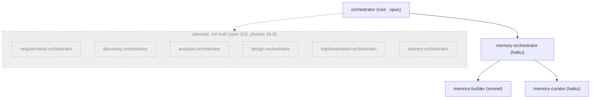
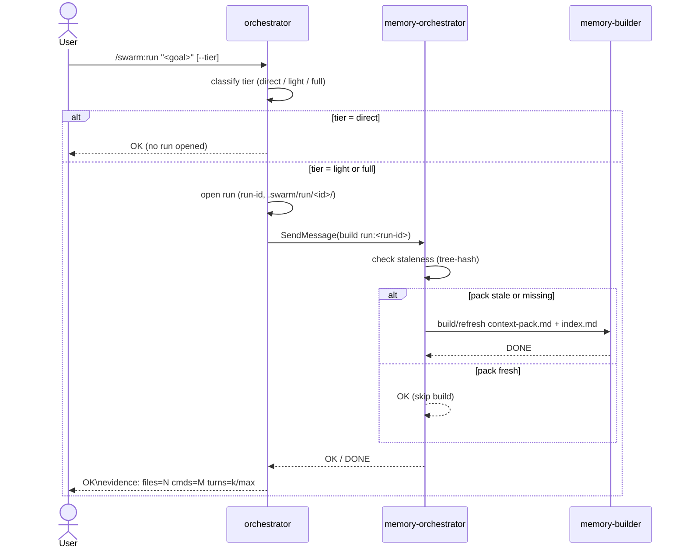
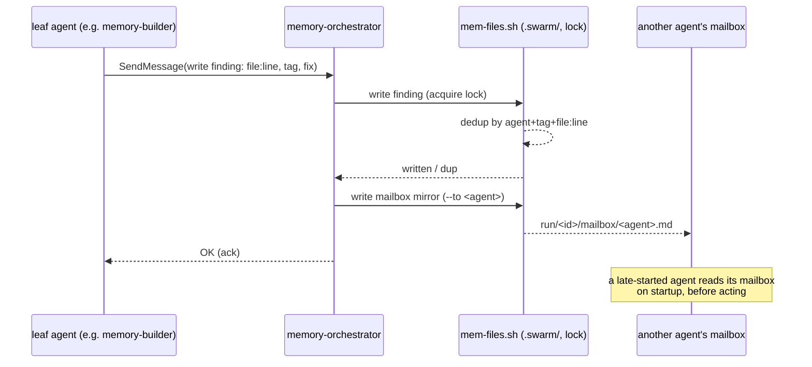

# swarm

Claude Code plugin. Single-responsibility agent swarm for the software development lifecycle — analysis, design, implementation, delivery — optimized for quality per token. Full design in `docs/superpowers/specs/2026-09-01-swarm-design.md`. **Phase 1 (core) only right now**: memory subsystem + root orchestrator.

## Install

No marketplace listing yet — local dev only:

```bash
claude --plugin-dir /path/to/multiagents
```

## Commands (phase 1 — core)

- `/swarm:init` — creates `.swarm/` in the target repo, health-gated on the `files` backend.
- `/swarm:run <goal> [--tier=direct|light|full]` — launches the root orchestrator.

## How it works

### Architecture — what exists vs what's planned



The root `orchestrator` (opus) classifies the run tier and talks to exactly one domain today: `memory-orchestrator`, which owns `memory-builder` (builds/refreshes the context-pack) and `memory-curator` (compacts findings, GC). Every other domain in the design — requirements, discovery, analysis, design, implementation, delivery — is spec'd but not implemented (see status below).

### `/swarm:run` flow



`direct` never opens a run and never touches memory — the root answers itself. `light`/`full` open a run and always check the pack before doing anything else; the pack is only rebuilt when stale (tree-state hash), never unconditionally.

### Memory write / mailbox



No agent scans the repo or `.swarm/` twice, and no agent writes `.swarm/` directly — every write (finding, decision, mailbox) goes through the single `memory-orchestrator` instance for the run, which serializes writes with a lock. Every `SendMessage` between leaves is also mirrored to the recipient's mailbox, so a sibling launched later in the run — or one addressed before it existed — still reads what it missed.

## Current status — what's built vs planned

Phases from spec §15:

1. **Core (built).** `orchestrator`, memory subsystem (`memory-orchestrator` + `memory-builder` + `memory-curator`, `files`/`claude-mem` backends), `swarm-protocol` skill, hooks (evidence-contract validation + bash allowlist), `/swarm:init`, smoke tests 1-8.
1b. **Requirements (planned).** `requirements-orchestrator`, `env-checker`, `dependency-auditor`/`dependency-installer`, `/swarm:doctor`.
2. **Discovery (planned).** `discovery-orchestrator` + 4 leaves, `AskUserQuestion` integration in the root.
3. **Analysis (planned).** `analysis-orchestrator` + 6 read-only lenses.
4. **Design (planned).** `design-orchestrator`, `planner`, `pattern-advisor`, `domain-modeler`, grill×3 integration.
5. **Implementation (planned).** 7 agents + the `php-ddd-symfony8` stack pack.
6. **Delivery (planned).** 3 agents + `/swarm:status`, `/swarm:findings`.

## Naming convention

Every spawned agent is launched **named after its role** — the basename of its type, no suffixes or variants (`memory-orchestrator`, and in future phases `security-auditor`, `analysis-orchestrator`, …). This is what lets peer agents `SendMessage` each other by name without discovering it first, and lets the owner address a specific agent directly — "tell `memory-builder` when it's done" — without the caller having to look up who that is. `memory-orchestrator` is the one case that's mandatory today: a single named instance per run (spec §4.5).

## Tests

```bash
bash tests/run.sh
```

## License

MIT © David García Gordo
