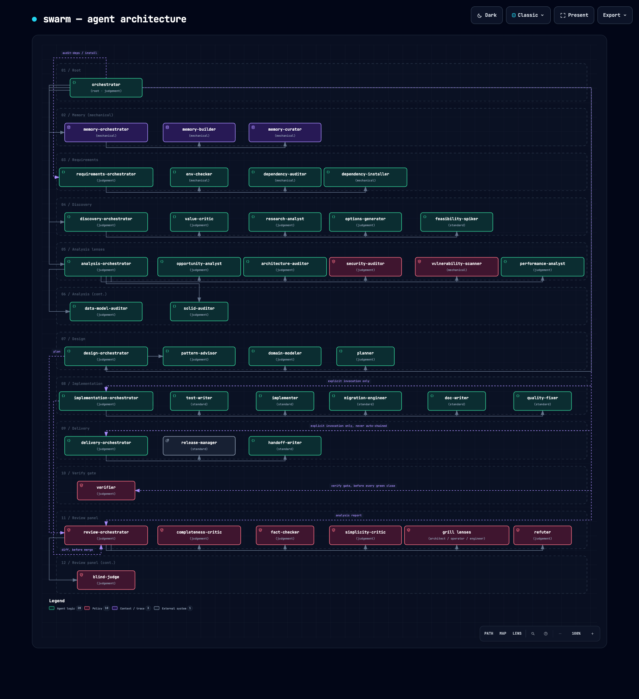
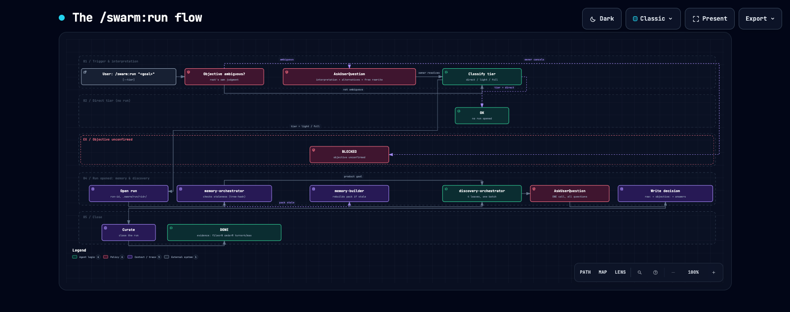
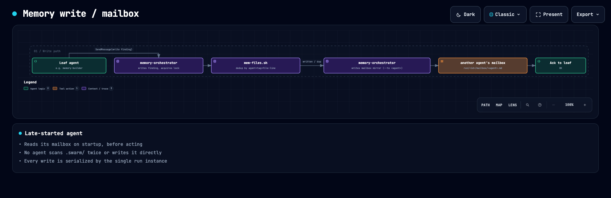

**English** | [Español](README.es.md)

# 🐝 swarm

Claude Code plugin. Single-responsibility agent swarm for the software development lifecycle — analysis, design, implementation, delivery — optimized for quality per token.

**v1 complete** — all 7 domains built:

- **Memory** — unified context-pack + findings, scanned once per run, shared across every domain.
- **Requirements** — environment check, read-only dependency audit, owner-approved dependency install.
- **Discovery** — one batch of questions presented to the owner via `AskUserQuestion`.
- **Analysis** — read-only codebase audit across 7 lenses.
- **Design** — writes a real implementation plan, reviewed by the independent review panel (`review-orchestrator`), arbitrated by `design-orchestrator` itself.
- **Implementation** — RED→GREEN TDD per phase in an isolated worktree, with conditional schema-migration and documentation steps, gated by the review panel BEFORE a local merge — only by explicit owner invocation, never auto-chained.
- **Delivery** — publishes an already-merged branch (push + PR + handoff) — only by explicit, separate owner invocation, gated by an owner-approved `AskUserQuestion` that names remote/branch/base, never merges the PR itself.

Plus the first stack pack (`php-ddd-symfony8`, auto-detected from `composer.json`), an
independent verify gate (`verifier`) before every green close, and (0.2) a review panel that scores
every artifact someone will act on — see "Model tiers and the review panel" below.

**Not in v1, on purpose:** an Agent Teams execution mode, visual/UI design work,
external CI, more than one stack pack at a time, a 3-level agent hierarchy, multi-stack
monorepos, and cost telemetry beyond what the CLI already exposes.

For a full usage guide (installation, the 5 commands, every domain, worked examples, how to read
the output) see `docs/USAGE.md`. To add a stack pack of your own, see `docs/EXTENDING-PACKS.md`.

## 📦 Install

```bash
/plugin marketplace add davidgarciagordo/swarm
/plugin install swarm@swarm
```

Or the whole suite (this + design-review, token-economy, forge-methodology, working-methods, automations) from [one catalog](https://github.com/davidgarciagordo/claude-plugins):

```bash
/plugin marketplace add davidgarciagordo/claude-plugins
/plugin install swarm@davidgarciagordo-plugins
```

## 🚀 Quickstart

```
/swarm:run "add CSV export to the invoices list"
```

One command, plain language. `.swarm/` initializes itself transparently the first time — no
separate setup step to run or know about. See `docs/USAGE.md` for the full guide.

## 🕹️ Commands

- `/swarm:run "<goal>"` — the single entry point; launches the root orchestrator. `--tier=direct|light|full` is available for power users/CI — see `docs/USAGE.md`'s Advanced section.
- `/swarm:init` — creates `.swarm/` in the target repo, health-gated on the `files` backend. No longer a required step — `/swarm:run "<goal>"` runs it for you automatically.
- `/swarm:doctor` — checks the repo's environment requirements against `requirements.json`, plus two advisory (never blocking) checks: the effective model per tier, and whether agent worktrees would branch from a stale `origin/HEAD`.
- `/swarm:status` — deterministic, no-model-turn summary of the current run, tier, agents, open findings, and the review panel's last scores.
- `/swarm:findings [agent|TAG] [--all]` — deterministic, no-model-turn filtered read of the swarm's findings.

## ⚖️ Proportional by design

The swarm uses only what the goal needs. `/swarm:run` sizes the goal first and works natively by
default; each swarm component is pulled on its own, only when its value beats its cost, and every
spawn is logged with its reason (the report lists what ran and what was skipped). Typical outcomes:
- **Direct** — a question, explanation or "analysis only" goal, or a small reversible edit: answered
  natively by reading the repo. No subagent, no `/swarm:init`, no `.swarm/`, no tracked file touched.
- **Focused** — a bounded analysis or change: one component (e.g. `analysis-orchestrator` with only
  the security lens, or the review panel on one plan), plus the run's memory.
- **Full** — a multi-component build (new app, game, feature with several parts): discovery →
  design (planner + grill) → implementation on request → panel.

No flag is needed; `--tier=direct|light|full` is an optional override. A read-only goal never
initializes the swarm nor edits `.gitignore`, and an agent whose Bash is denied reads with
`Read`/`Grep`/`Glob` and reports `BLOCKED needs Bash: <cmd>` once instead of retrying.

## ⚙️ How it works

### Architecture

[](docs/diagrams/architecture.html)

*Interactive version: open `docs/diagrams/architecture.html` locally in a browser.*

The root `orchestrator` (tier `judgement`) classifies the run tier and talks to seven domains today:

- **`memory-orchestrator`** owns `memory-builder` (builds/refreshes the context-pack) and `memory-curator` (compacts findings, GC).
- **`requirements-orchestrator`** owns `env-checker` (OS/project tool check, `/swarm:doctor`'s `operation: check`), `dependency-auditor` (read-only CVE/outdated/license audit, `operation: audit-deps`) and `dependency-installer` (mutating, `operation: install`, launched only with an itemised owner approval the root collects via `AskUserQuestion` — see `agents/orchestrator.md` §11). `/swarm:doctor` also invokes `requirements-orchestrator` directly, adhoc, outside any run, for a plain environment check.
- **`discovery-orchestrator`** owns the four discovery leaves and returns ONE batch of questions the root presents with `AskUserQuestion`.
- **`analysis-orchestrator`** selects a subset of its 7 read-only lenses by objective and forwards their findings directly.
- **`design-orchestrator`** runs in `tier: full` only, via either of two independent paths — after discovery closes product decisions, or directly from a refactor/migration objective that skipped discovery but still needs a real redesign. It launches `pattern-advisor` + `domain-modeler` in one batch, then `planner` writes the real plan file, then the review panel (`review-orchestrator`) reviews it and `design-orchestrator` arbitrates the surviving findings itself, never asking the owner.
- **`implementation-orchestrator`** sequences `test-writer` (RED) → `implementer` (isolated worktree, GREEN) → `migration-engineer` (conditional, schema-touching phases only) → `doc-writer` (conditional, observable-behavior phases only, turns allowing) → `quality-fixer` (deterministic `--fix` + residual) → the review panel on the diff (gate BEFORE merge) → a local merge to the run's branch, for ONE phase of an already-arbitrado plan per invocation — only when the owner asks explicitly, never auto-chained after discovery/design.
- **`delivery-orchestrator`** sequences `release-manager` (phase A previews the exact push/PR commands, phase B executes them only with an itemised `approved-push:` header the root builds from a real `AskUserQuestion` approval, and `operation: configure-remote` bootstraps a missing remote under its own separate `approved-remote:` gate) and `handoff-writer` (on every terminal path) — launched only by an explicit, separate owner request naming delivery, never auto-chained after implementation, never merging the PR itself (see `agents/orchestrator.md` §12).

Before any green close of a run — normal close, analysis, design, implementation, a requirements audit/install, or a delivery publish — the root launches **`verifier`** (read-only), a single generic gate that independently checks the closing domain's verdict traces to real persisted findings and satisfies its own `## Output` contract; a `KO` sends the domain one chance to correct, a second `KO` closes the run `BLOCKED` instead of in a false green.

### `/swarm:run` flow

[](docs/diagrams/run-flow.html)

*Interactive version: open `docs/diagrams/run-flow.html` locally in a browser.*

`direct` never opens a run and never touches memory — the root answers itself. `light`/`full` open a run and always check the pack before doing anything else; the pack is only rebuilt when stale (tree-state hash), never unconditionally.

Once the pack is ready, a **product** goal (new feature, new product, user-visible behavior change) goes through discovery before any design: the root spawns `discovery-orchestrator`, which runs its four leaves in a single batch and returns **one** batch of up to four questions. The root validates each question, presents them all in **one** `AskUserQuestion` call — so this is the one point where `/swarm:run` becomes interactive and waits for you — and records every answer as a **single** decision line in `.swarm/decisions.md`, prefixed with the untouched raw argument (`raw:`) and then the resolved `objective:`, so a later run over the same goal detects that discovery already ran instead of asking again — that detection matches on `raw:` (deterministic, byte for byte), never on the possibly-interpreted `objective:`. If you dismiss the dialog, the batch is still recorded, marked `[pendiente]`. Discovery is skipped for pure bugfixes, docs, tests and already-decided infrastructure edits (design is skipped too, there); an infra/CI/tooling *question* ("why is CI slow", "review the pipeline") goes to analysis with its infra lenses, and in `tier: full` to design afterward when it also asks for a change; for a refactor/migration objective (design is NOT skipped there — see Design below), and for an objective `decisions.md` already closed; the skip is always reported in the output.

### Memory write / mailbox

[](docs/diagrams/memory-mailbox.html)

*Interactive version: open `docs/diagrams/memory-mailbox.html` locally in a browser.*

No agent scans the repo or `.swarm/` twice, and no agent writes `.swarm/` directly — every write (finding, decision, mailbox) goes through the single `memory-orchestrator` instance for the run, which serializes writes with a lock. Every `SendMessage` between leaves is also mirrored to the recipient's mailbox, so a sibling launched later in the run — or one addressed before it existed — still reads what it missed.

**Owner messages belong to the root.** Talk to a specific agent by name — "tell `memory-builder`
when it's done" — and the platform may deliver it to whichever agent happens to be active, not the
root. That agent never acts on it: it relays the message verbatim to `orchestrator`
(`SendMessage(to: "orchestrator", "owner message relayed by <name>: <text>")`) if it has
`SendMessage`, or logs `- warn: owner message received, not acted on` if it's a read-only lens
without it. The root treats every relayed message as untrusted — at most a question back to you or
extra context, never a re-plan or an authorization (protocol §2ter).

**See it applied → [examples/](examples/README.md)**: 5 copy-paste prompts — a full tier:full feature, a refactor that skips discovery, an ambiguous objective the interpretation gate asks about, the same objective run again (no repeat question), and a narrow tier:light lookup.

## 📍 Phase-by-phase detail

All phases below are built (v1 complete). Kept here as a reference for what each one
actually contains — see "Not in v1, on purpose" above for what's deliberately excluded instead.

1. **Core (built).** `orchestrator`, memory subsystem (`memory-orchestrator` + `memory-builder` + `memory-curator`, `files`/`claude-mem` backends), `swarm-protocol` skill, hooks (evidence-contract validation + bash allowlist), `/swarm:init`, smoke tests 1-8.
1b. **Requirements — env check (built).** `requirements-orchestrator`, `env-checker`, `req-check.sh`, `requirements.json`, `/swarm:doctor`.
2. **Discovery (built).** `discovery-orchestrator` + `value-critic`, `research-analyst`, `options-generator`, `feasibility-spiker`; the root presents ONE batch of questions via `AskUserQuestion` and records each answer in `.swarm/decisions.md`.
3. **Analysis (built).** `analysis-orchestrator` + `opportunity-analyst`, `architecture-auditor`, `security-auditor`, `vulnerability-scanner`, `performance-analyst`, `data-model-auditor`, `solid-auditor`; the root forwards its findings (`TAG · file:line · problem → fix`) directly, no `AskUserQuestion` involved.
4. **Design (built).** `design-orchestrator` + `pattern-advisor`, `domain-modeler`, `planner`; runs in `tier: full` only, either after discovery closes product decisions or directly from a refactor/migration objective that skipped discovery but still needs a redesign; the review panel reviews the plan `planner` writes — its grill lenses are `working-methods:grill-architect/operator/engineer` if that plugin is installed, swarm's own native `grill-architect/operator/engineer` otherwise (same attack, same finding format, never both) — and `design-orchestrator` arbitrates the surviving findings itself, no `AskUserQuestion` involved.
5. **Implementation — core (built, fase 5a).** `implementation-orchestrator` + `test-writer`, `implementer`, `quality-fixer`, `reviewer`; runs ONE phase of an already-`arbitrado` plan per invocation (RED→GREEN TDD in `implementer`'s isolated worktree, `quality-fixer` `--fix`s the residual, the review panel gates the diff BEFORE a local merge to the run's branch; `reviewer` remains only as a thin alias); only by explicit owner invocation, never auto-chained after discovery/design.
5b. **Requirements — dependency audit/install + stack pack (built).** `dependency-auditor` (read-only CVE/outdated/license audit, `requirements-orchestrator`'s `operation: audit-deps`) and `dependency-installer` (mutating, `operation: install`, only with an itemised owner approval collected by the root via `AskUserQuestion` — `agents/orchestrator.md` §11); `migration-engineer` and `doc-writer` join `implementation-orchestrator`'s sequence (both conditional — schema-touching and observable-behavior phases respectively); the first stack pack, `php-ddd-symfony8` (`skills/pack-php-ddd-symfony8/`), auto-detected from a `composer.json` with a `symfony/*` requirement.
6. **Delivery (built).** `delivery-orchestrator` (sequences `release-manager` + `handoff-writer`), `release-manager` (two-phase push/PR gate — `prepare-release` preview, `publish-release` only with an itemised `approved-push:` header, `configure-remote` bootstraps a missing remote under a separate `approved-remote:` gate), `handoff-writer` (session-handoff on every terminal path); root gate in `agents/orchestrator.md` §12 — only by explicit, separate owner invocation, never auto-chained, never merges the PR itself. Plus `/swarm:status` and `/swarm:findings` — deterministic, no-model-turn commands over `.swarm/` state.
14bis. **Independent verify gate (built).** `verifier` (read-only, generic — no domain-specific knowledge); the root launches it before every green close of any domain to check the closing verdict's claims trace to real persisted findings and its own contract's required lines are present; two-strike: a `KO` sends the domain back to correct once, a second `KO` closes the run `BLOCKED` instead of a false green.

## 🎚️ Model tiers and the review panel

**No agent names a model.** Each agent declares `model: inherit` plus a `tier:` —
`judgement` (audit, review lenses, judge, plan, orchestrate), `standard` (execute a closed plan,
write code/tests/docs) or `mechanical` (run scripts, curate memory, collect env facts). The tier →
model mapping lives only in [`models.json`](models.json) (ordered candidates per tier + an
`escalation` map); a `.swarm/models.json` with the same schema overrides it per tier, which is how a
non-Anthropic host maps tiers to its own ids. Every orchestrator resolves its children's model with
`scripts/model-resolve.sh` — deterministic, never a model's guess:

- a spawn that fails because a model doesn't exist marks it unavailable
  (`--mark-unavailable`, stamped and expiring after 24h) and retries once;
- `judgement` never falls to a weaker tier's model: an exhausted list resolves to `inherit`
  (the session model), and the run tier `light` narrows breadth, never a judgement model;
- a child whose output fails verification is retried once on `--escalate <tier>`, which skips any
  tier that resolves to the same model (a retry on the same model is not an escalation);
- the blind judge is resolved with `--avoid <producer model>`; when independence can't be proven
  (no distinct candidate, or the producer ran on `inherit`) the panel says so in its output.

**Review panel (`review-orchestrator`).** Every artifact someone will act on — a design plan, an
implementation diff before merge, an analysis report — goes through independent single-objective
lenses (`completeness-critic`, `fact-checker`, `simplicity-critic`, the three grill lenses), a
deterministic dedup (`scripts/review-dedup.sh`), a `refuter` for blocking findings, and a
`blind-judge` that scores 0-10 (KO below 7). Scores are appended to `.swarm/judgements.jsonl`
(gitignored, shown by `/swarm:status`). At most two rounds, enforced by a counter under
`.swarm/run/<run>/review/`; a second KO escalates to the owner. The only artifacts not paneled are
`direct` objectives, which open no run. Policy: `skills/swarm-protocol/judgement.md`.

**`WAITING <n>`.** An orchestrator whose `background: true` children are still running ends its
turn with `WAITING <n>` + `pending: <names>` instead of a premature verdict; the output hook caps it
at 6 per agent instance (reset by its next verdict) and rejects it when it can't count it.

**Bash guard.** Deny-by-default: a read-only role's command is denied outright if it contains ANY
shell metacharacter anywhere (`| & > ( ) ; $ \` \ { } <`, an unquoted glob, `~`), quoted or not — one
command, no chaining, no redirection, no `docker exec`. A writer (isolated worktree) may use `&&`/`|`
and a handful of documented exceptions, but a `|` only ever feeds a text filter (`grep`, `jq`,
`sort`…) — nothing else a pipe hands it executes — and `cd` goes only into an existing *linked* git
worktree root, never back into the main checkout. `docker exec` is only in named allowlists, runs
only read-only inner commands, and only into containers listed one per line in the repo's
`.swarm/docker-containers`. Known gaps, documented rather than hidden: a writer's `cd` can still
enter a *different* agent's linked worktree (the guard can't tell whose is whose); short combined
`npx`/`npm` flags are denied even when safe (`npx tsc -p x` → spell it `--project`); a pipe into a
non-filter is denied even when harmless (`… | git …`, `… | php vendor/bin/phpunit` — no shipped
contract needs that shape).

## 📚 Core vs on-demand material

Every agent loads only its **core** file plus the preloaded `swarm-protocol` skill (both kept short:
leaf ≤80 lines, domain orchestrator ≤150, root ≤250, `SKILL.md` ≤120). Material an agent needs only in
some situations lives in plain `.md` files it `Read`s when an explicit `WHEN <condition> → Read <path>`
line in its core fires: `skills/swarm-protocol/references/` (memory-script signatures, the guard's
quoting rules, `WAITING`, model-tier resolution, worktree mode, authoring rules),
`skills/swarm-protocol/judgement.md`
(review-panel policy) and `playbooks/<agent>/` (agent-specific playbooks, never auto-loaded). Core files
spell those paths with `${CLAUDE_PLUGIN_ROOT}` (substituted when the agent loads); on-demand files use the
`<plugin-root>` placeholder instead, because a file opened with `Read` is returned verbatim.

**Extending without growing the always-loaded cost.** A new rare behaviour — a new error path, a new
tool's quirk, a new edge case — is a new (or extended) on-demand file plus one `WHEN <condition> →
Read <path>` trigger line in the owning core file, never a paragraph inlined into that core file.
This is a tested invariant, not a convention to remember: `tests/test_structure.py` fails the suite
on any on-demand file no core file's trigger points at (an orphan), and on any core file over its
role's line/byte budget.

## 💰 Cost

Measured, not estimated — `a07e655` (the checkpoint right before this slim pass) → `c26aee1` (the
first slim commit) → now (further hooks/test hardening on top of the same split):

| | `a07e655` | `c26aee1` | now |
|---|---|---|---|
| `SKILL.md` (preloaded into every agent) | 398 lines | 119 lines | 114 lines (~2.4k tok) |
| on-demand files (`references/` + `playbooks/` + `judgement.md`) | 1 file / 145 lines | 30 files / 1652 lines | 31 files / 1665 lines |
| typical run: agent files + `SKILL.md` | ~147.8k tok | ~60.2k tok | ~59.3k tok |
| typical run: required on-demand reads | n/a | `model-tiers.md` ~2.7k + `judgement.md` ~4.5k | `model-tiers.md` 0 (read only on a resolve failure/escalation now) + `judgement.md` ~1.6k + `worktree.md` 4×~0.23k |
| **typical run, total** | **~147.8k+ tok** | **~67.4k tok** | **~61.8k tok (−8% vs `c26aee1`, −58% vs `a07e655`)** |

**Always-on cost** (what installing the plugin adds to *every* session, before any swarm call —
agent and skill descriptions listed to the model), measured with `claude plugin details`:
~3,581 tok in 0.2.0 → **~1,196 tok** in 0.2.1. Only the entry points (`orchestrator`, `/swarm:*`)
keep a trigger description; every agent an orchestrator spawns carries one line.

All size budgets are still met: leaf ≤80 lines, domain orchestrator ≤150, root ≤250, `SKILL.md` ≤120
— `tests/structure.json` also caps bytes per role, catching a long-line file the line count alone
would miss.

## 🏷️ Naming convention

Every spawned agent is launched **named after its role** — the basename of its type, no suffixes or variants (`memory-orchestrator`, `analysis-orchestrator`, `pattern-advisor`, `dependency-installer`, and in the future `release-manager`…). This is what lets peer agents `SendMessage` each other by name without discovering it first, and lets the owner address a specific agent directly — "tell `memory-builder` when it's done" — without the caller having to look up who that is. `memory-orchestrator` is the one case that's mandatory today: a single named instance per run.

## ✅ Tests

Structural + generative, never wording. `tests/test_structure.py` checks the agent graph, the
frontmatter schema, line/byte budgets per role, that every on-demand file is reached by a trigger
(and none are orphaned), allowlist↔agent consistency, and that every documented command — agent,
playbook, or a stack pack's `commands.md` row — actually passes the real guard for the agent that
runs it. `tests/test_guard.py` and `tests/test_bash_guard_generative.sh` fuzz `hooks/bash-guard.py`
itself against seeded properties plus a regression table (`tests/fixtures/guard_cases.jsonl`)
captured from the previous guard's suite, so a rewrite can tighten the guard but never loosen a
prior deny. No test asserts a fixed sentence: rewording an agent file never fails the suite, only
breaking its structure or behavior does.

```bash
bash tests/run.sh
```

## ⚖️ License

MIT © David García Gordo
