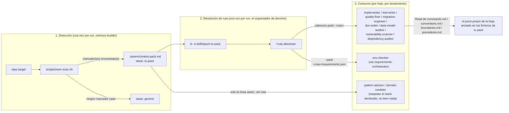

# Crear un stack pack nuevo

`swarm` trae exactamente un stack pack hoy, `skills/pack-php-ddd-symfony8/` (PHP + DDD + Symfony).
Esta guía es la pieza que faltaba: cómo escribir un **segundo**, para el stack que quieras, para que
las hojas del enjambre dejen de improvisar de forma genérica en ese tipo de repo y empiecen a leer
convenciones reales.

Si aún no has leído la sección "Stack packs" de `docs/USAGE.es.md`, léela primero — explica qué es
un pack y qué pasa sin él. Esta guía es el "cómo se construye uno" complementario a esa sección de
"qué es".

## El flujo, en una imagen



Nada de este flujo es auto-descubrimiento conectable — la detección del paso 1 es una cadena
`if`/`elif` corta y escrita a mano en `scripts/mem-scan.sh`. Añadir un pack significa añadir una
rama ahí, no soltar un directorio en algún sitio y esperar que se recoja solo.

## El contrato de 6 ficheros (spec §8)

Todo pack vive en `skills/pack-<nombre>/` y tiene exactamente estos ficheros:

| fichero | propósito |
|---|---|
| `SKILL.md` | descripción + el/los marcador(es) de detección de este pack |
| `commands.md` | la forma canónica de cada comando determinista (lint/fix/typecheck/test/scan-deps/etc.) |
| `conventions.md` | naming, capas, estilo de arquitectura de este stack |
| `boundaries.md` | qué NUNCA se toca (código generado, dependencias vendorizadas, migraciones aplicadas…) |
| `precedents.md` | patrones ya en uso, para que una hoja reutilice en vez de reinventar |
| `requirements.json` | herramientas de OS / ficheros de proyecto / librerías que este stack necesita, fusionadas en el chequeo de `/swarm:doctor` |

Lee los reales en `skills/pack-php-ddd-symfony8/` como referencia — cada ejemplo de abajo está
anclado en el contenido real y funcionando de ese pack, no en sintaxis inventada.

## `commands.md` — la parte que tiene que estar exacta

Este es el fichero que un test real (`tests/test_stack_pack.sh`) parsea y verifica comando por
comando contra el guard real de permisos. Si le fallas la forma, tu pack falla en silencio cerrado —
una hoja simplemente no encuentra comando para esa clave, sin error, porque "sin comando para esta
clave" es un resultado válido y esperado para cualquier clave.

**Formato de tabla**, cuatro columnas, exactamente esta cabecera:

```
| clave | condición | comando | ejecutor |
```

- **clave** — un conjunto CERRADO: `lint`, `fix`, `typecheck`, `test`, `test-one`, `scan-deps`,
  `outdated`, `licenses`, `scan-secrets`, `sast`, más las tres claves de migración
  (`migrate-diff`/`migrate-status`/`migrate-up`) si tu stack tiene migraciones. Una clave fuera de
  este conjunto es invisible para toda hoja — solo piden una de estas.
- **condición** — cómo elige una hoja entre filas de la MISMA clave cuando tu stack tiene más de una
  herramienta para ella (mira las dos filas de `lint` del pack de referencia, una por formateador).
  **Gana la primera fila cuya condición se cumple.**
- **comando** — entre backticks, el comando exacto que una hoja corre literal. Los `<placeholders>`
  entre corchetes angulares son la única sustitución permitida.
- **ejecutor** — uno o más nombres de agente, separados por `+`, que dicen qué hoja(s) puede(n)
  correr esa fila.

**La restricción que de verdad muerde**: cada comando tiene que tener su prefijo YA en la entrada de
`hooks/bash-allowlist.json` de su ejecutor, o el guard lo deniega en tiempo de ejecución — en
silencio, desde el punto de vista de la hoja, como una denegación de permiso normal.
`tests/test_stack_pack.sh` pilla esto para el pack ya construido corriendo cada fila contra el guard
real; haz lo mismo con el tuyo (ver "Probar tu pack" más abajo) antes de fiarte de una sola fila.

**Nunca encadenes dos comandos con `&&`** — el guard deniega segmentos multi-comando directamente, y
una fila de pack que asume encadenamiento nunca llegará a correr.

## Detección — editar `scripts/mem-scan.sh`

Abre el script y busca la cadena `if`/`elif` ya existente. Añade tu propia rama, siguiendo la misma
forma que la de PHP:

```bash
elif [ -f "$ROOT/pyproject.toml" ] && grep -q "pytest" "$ROOT/pyproject.toml" 2>/dev/null; then
  stack="python-pytest"
```

Elige un marcador barato de comprobar (que exista un fichero, un grep de subcadena) y poco probable
que dé falso positivo en un repo no relacionado. El marcador del pack de PHP ya existente
(`composer.json` con `symfony/` en cualquier parte del fichero, no solo bajo `require`) es el nivel
de especificidad al que apuntar — bastante estrecho para significar algo, no tan estrecho que se
pierda repos reales de ese stack.

## Allowlist — el paso que es fácil olvidar

Las filas de `commands.md` de un pack solo pueden nombrar herramientas que sus hojas ejecutoras ya
tengan permitidas. Las hojas genéricas de ejecución (`test-writer`, `quality-fixer`, `implementer`,
`migration-engineer`) ya llevan prefijos de dos palabras amplios para varios ecosistemas — `pytest`,
`go`, `cargo`, `npm`, `npx`, `make`, junto a `php`/`composer` — así que una fila `test`/`fix` para
esos stacks puede que ya funcione sin cambios de allowlist. Pero las hojas READ-ONLY que solo tienen
concesiones de dos palabras para sus herramientas exactas ya existentes (`vulnerability-scanner`,
`dependency-auditor`) NO tienen nada para un ecosistema nuevo por defecto — vas a necesitar añadir
entradas como `"pip-audit"` o `"safety check"` a `hooks/bash-allowlist.json` tú mismo, igual que
`composer audit`/`npm audit` ya están ahí hoy para esas dos hojas en concreto.

**Verifica, nunca asumas**, contra el guard real:

```bash
printf '{"agent_type": "swarm:vulnerability-scanner", "tool_name": "Bash", "tool_input": {"command": "pip-audit --format=json"}}' | python3 hooks/bash-guard.py
```

Salida vacía (exit 0) significa allow. Cualquier JSON con `"permissionDecision": "deny"` significa
que tu fila de `commands.md` para esa hoja nace muerta — arregla el allowlist, no el texto de la fila.

## Ejemplo trabajado: un pack mínimo `python-pytest`

Esto esboza la forma, no un pack completo — trátalo como esqueleto de partida, no como algo para
copiar literal a producción.

**`skills/pack-python-pytest/SKILL.md`**
```markdown
# python-pytest

Detecta: `pyproject.toml` en la raíz del repo que contiene una referencia a `pytest` (como
dependencia o en una sección de configuración). Id de stack usado en `.swarm/context-pack.md`:
`python-pytest`.
```

**`skills/pack-python-pytest/commands.md`** (extracto — solo las filas que cubre este ejemplo)
```markdown
| clave | condición | comando | ejecutor |
|---|---|---|---|
| test | existe `pyproject.toml` con `pytest` | `pytest -q` | test-writer + implementer |
| lint | existe `pyproject.toml` con `[tool.ruff]` | `ruff check .` | quality-fixer |
| fix | existe `pyproject.toml` con `[tool.ruff]` | `ruff check --fix .` | quality-fixer |
| typecheck | existe `pyproject.toml` con `[tool.mypy]` | `mypy .` | quality-fixer |
| scan-deps | existe `requirements.txt` o `pyproject.toml` | `pip-audit --format=json` | dependency-auditor |
```

**Ampliaciones de allowlist que necesita este ejemplo** (verifica cada una con el comando de guard de
arriba antes de fiarte): la entrada de `swarm:quality-fixer` en `hooks/bash-allowlist.json` necesita
`"ruff"` y `"mypy"` añadidos; `swarm:dependency-auditor` necesita `"pip-audit"` añadido.
`test-writer`/`implementer` ya tienen `pytest` — sin cambios ahí, confirmado arriba.

**Añadido a `scripts/mem-scan.sh`**:
```bash
elif [ -f "$ROOT/pyproject.toml" ] && grep -q "pytest" "$ROOT/pyproject.toml" 2>/dev/null; then
  stack="python-pytest"
```

`conventions.md`, `boundaries.md`, `precedents.md` y `requirements.json` siguen la misma forma que
los del pack de PHP — léelos directamente, no hay ningún giro específico de Python en el contrato de
ninguno de los otros tres ficheros.

## Probar tu pack

Replica la estructura de `tests/test_stack_pack.sh` para tu propio pack (está fijado al único pack ya
construido hoy, así que escribe un fichero hermano en vez de editarlo):

1. Comprueba que existen los 6 ficheros.
2. Comprueba que `SKILL.md` documenta tu marcador de detección real.
3. Parsea la tabla de `commands.md` igual que el test de referencia, y para cada fila, corre su
   comando contra `hooks/bash-guard.py` con el `agent_type` real de su ejecutor nombrado — comprueba
   `allow`. Es la comprobación más valiosa de todas: es la que habría pillado cada "se me olvidó
   actualizar el allowlist" del propio ejemplo trabajado de esta guía, antes de que una hoja lo
   sufriera en vivo.
4. Corre la suite completa (`bash tests/run.sh`) y confirma que no rompiste nada más.

## Lo que un pack NO necesita

Ningún código, ningún registro de plugin, ningún paso de build. Lo lee una hoja vía la tool `Read`
normal — un pack es datos que el enjambre lee, no código que el enjambre ejecuta. El único "cableado"
son las dos ediciones de arriba (la rama de detección de `mem-scan.sh`, y las entradas de allowlist
que tus comandos necesiten) — todo lo demás es Markdown/JSON que una hoja lee por su propio criterio.
