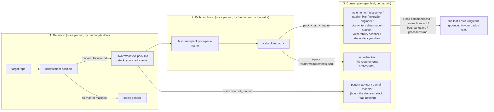

# Writing a new stack pack

`swarm` ships exactly one stack pack today, `skills/pack-php-ddd-symfony8/` (PHP + DDD + Symfony).
This guide is the missing piece: how to write a **second** one, for a stack of your choice, so the
swarm's leaves stop guessing generically on that kind of repo and start reading real conventions
instead.

If you haven't read `docs/USAGE.md`'s "Stack packs" section yet, read that first — it explains what
a pack is and what happens without one. This guide is the "how to build one" companion to that
"what it is" section.

## The flow, in one picture



Nothing in this flow is pluggable auto-discovery — step 1's detection is a short, hand-written
`if`/`elif` chain in `scripts/mem-scan.sh`. Adding a pack means adding a branch there, not dropping
a directory somewhere and hoping it gets picked up.

## The 6-file contract (spec §8)

Every pack lives at `skills/pack-<name>/` and has exactly these files:

| file | purpose |
|---|---|
| `SKILL.md` | description + the detection marker(s) this pack matches on |
| `commands.md` | the canonical form of every deterministic command (lint/fix/typecheck/test/scan-deps/etc.) |
| `conventions.md` | naming, layering, architecture style for this stack |
| `boundaries.md` | what NEVER to touch (generated code, vendored dependencies, applied migrations…) |
| `precedents.md` | patterns already in use, so a leaf reuses instead of reinventing |
| `requirements.json` | OS tools / project files / libraries this stack needs, merged into `/swarm:doctor`'s check |

Read the real ones in `skills/pack-php-ddd-symfony8/` as your reference — every example below is
grounded in that pack's actual, working content, not invented syntax.

## `commands.md` — the part that has to be exactly right

This is the file a real test (`tests/test_stack_pack.sh`) parses and verifies command-by-command
against the real permission guard. Get its shape wrong and your pack silently fails closed — a leaf
just won't find a command for a key, with no error, because "no command for this key" is a valid,
expected outcome for every key.

**Table format**, four columns, exactly this header:

```
| clave | condición | comando | ejecutor |
```

- **clave** — one of a CLOSED set: `lint`, `fix`, `typecheck`, `test`, `test-one`, `scan-deps`,
  `outdated`, `licenses`, `scan-secrets`, `sast`, plus the three migration keys
  (`migrate-diff`/`migrate-status`/`migrate-up`) if your stack has migrations. A key outside this
  set is invisible to every leaf — they only ever ask for one of these.
- **condición** — how a leaf picks between rows for the SAME key when your stack has more than one
  tool for it (see `lint`'s two rows in the reference pack, one per formatter). **The first row
  whose condition is true wins.**
- **comando** — backtick-quoted, the exact command a leaf runs verbatim. `<placeholders>` in angle
  brackets are the only substitution allowed.
- **ejecutor** — one or more agent names, `+`-separated, naming which leaf(s) may run this row.

**The constraint that actually bites**: every command's ejecutor must ALREADY have that command's
prefix in its own `hooks/bash-allowlist.json` entry, or the guard denies it at runtime — silently,
from the leaf's point of view, as a normal permission denial. `tests/test_stack_pack.sh` catches
this for the shipped pack by running every row through the real guard; do the same for yours (see
"Testing your pack" below) before you trust a single row.

**Never chain two commands with `&&`** — the guard denies multi-command segments outright, and a
pack row that assumes chaining will never actually run.

## Detection — editing `scripts/mem-scan.sh`

Open the script and find the existing `if`/`elif` chain. Add your own branch, following the same
shape as the PHP one:

```bash
elif [ -f "$ROOT/pyproject.toml" ] && grep -q "pytest" "$ROOT/pyproject.toml" 2>/dev/null; then
  stack="python-pytest"
```

Pick a marker that's cheap to check (a file's existence, a substring grep) and unlikely to false-
positive on an unrelated repo. The existing PHP pack's marker (`composer.json` containing
`symfony/` anywhere in the file, not just under `require`) is the level of specificity to aim for —
narrow enough to mean something, not so narrow it misses real repos of that stack.

## Allowlist — the step that's easy to forget

A pack's `commands.md` can only name tools its executor leaves are already allowed to run. The
generic-runner leaves (`test-writer`, `quality-fixer`, `implementer`, `migration-engineer`) already
carry broad two-word prefixes for several ecosystems — `pytest`, `go`, `cargo`, `npm`, `npx`, `make`,
alongside `php`/`composer` — so a `test`/`fix` row for those stacks may already work with zero
allowlist changes. But the READ-ONLY leaves that only ever get two-word-prefix grants for their exact
existing tools (`vulnerability-scanner`, `dependency-auditor`) do NOT have anything for a new
ecosystem by default — you will need to add entries like `"pip-audit"` or `"safety check"` to
`hooks/bash-allowlist.json` yourself, the same way `composer audit`/`npm audit` are there today for
those two leaves specifically.

**Verify, never assume**, against the real guard:

```bash
printf '{"agent_type": "swarm:vulnerability-scanner", "tool_name": "Bash", "tool_input": {"command": "pip-audit --format=json"}}' | python3 hooks/bash-guard.py
```

Empty output (exit 0) means allow. Any JSON with `"permissionDecision": "deny"` means your
`commands.md` row for that leaf is dead on arrival — fix the allowlist, not the row's wording.

## Worked example: a minimal `python-pytest` pack

This sketches the shape, not a complete pack — treat it as a starting skeleton, not something to
copy verbatim into production.

**`skills/pack-python-pytest/SKILL.md`**
```markdown
# python-pytest

Detects: `pyproject.toml` at the repo root containing a `pytest` reference (dependency or config
section). Stack id used in `.swarm/context-pack.md`: `python-pytest`.
```

**`skills/pack-python-pytest/commands.md`** (excerpt — only the rows this example covers)
```markdown
| clave | condición | comando | ejecutor |
|---|---|---|---|
| test | existe `pyproject.toml` con `pytest` | `pytest -q` | test-writer + implementer |
| lint | existe `pyproject.toml` con `[tool.ruff]` | `ruff check .` | quality-fixer |
| fix | existe `pyproject.toml` con `[tool.ruff]` | `ruff check --fix .` | quality-fixer |
| typecheck | existe `pyproject.toml` con `[tool.mypy]` | `mypy .` | quality-fixer |
| scan-deps | existe `requirements.txt` o `pyproject.toml` | `pip-audit --format=json` | dependency-auditor |
```

**Allowlist additions this example needs** (verify each with the guard command above before trusting
it): `hooks/bash-allowlist.json`'s `swarm:quality-fixer` entry needs `"ruff"` and `"mypy"` added;
`swarm:dependency-auditor` needs `"pip-audit"` added. `test-writer`/`implementer` already have
`pytest` — no change needed there, confirmed above.

**`scripts/mem-scan.sh` addition**:
```bash
elif [ -f "$ROOT/pyproject.toml" ] && grep -q "pytest" "$ROOT/pyproject.toml" 2>/dev/null; then
  stack="python-pytest"
```

`conventions.md`, `boundaries.md`, `precedents.md`, and `requirements.json` follow the same shape as
the PHP pack's — read those directly, there's no Python-specific twist to any of the other three
files' contracts.

## Testing your pack

Mirror `tests/test_stack_pack.sh`'s structure for your own pack (it's hardcoded to the one shipped
pack today, so write a sibling file rather than editing it):

1. Assert all 6 files exist.
2. Assert `SKILL.md` documents your real detection marker.
3. Parse `commands.md`'s table the same way the reference test does, and for every row, run its
   command through `hooks/bash-guard.py` with its named executor's real `agent_type` — assert
   `allow`. This is the single most valuable check: it's the one that would have caught every
   "forgot to update the allowlist" mistake in this guide's own worked example, before a leaf ever
   hit it live.
4. Run the full suite (`bash tests/run.sh`) and confirm nothing else broke.

## What a pack does NOT need

No code, no plugin registration, no build step. It's read by leaves via the plain `Read` tool — a
pack is data the swarm reads, not code the swarm runs. The only "wiring" is the two edits above
(`mem-scan.sh`'s detection branch, and whatever allowlist entries your commands need) — everything
else is Markdown/JSON a leaf reads at its own discretion.
