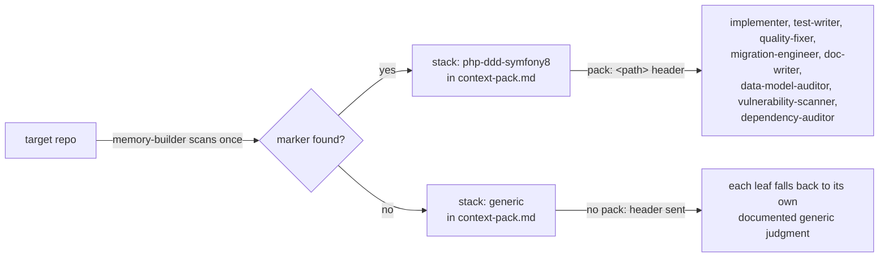

# Using swarm

A complete, standalone guide for someone who has never seen this plugin before. If you just want
the project status (what's built, what's planned), read `README.md` — this doc is about how to
actually run it.

## 1. What is this

`swarm` is a Claude Code plugin: it runs a swarm of single-responsibility subagents that help you
through the software development lifecycle on a real repo — understanding a codebase, auditing it,
designing a change, and implementing it. Every agent has one job (a security auditor never writes
code, a planner never implements), and a root orchestrator wires them together and reports back a
short, evidence-backed verdict instead of a wall of narration. The human stays in control of what
actually gets built: the swarm asks real questions when a decision needs a person, and it never
pushes anything anywhere on its own.

## 2. Installation

There is no marketplace listing for this plugin yet, so today the only real install path is local:
point Claude Code at the checkout directly.

```bash
claude --plugin-dir /path/to/multiagents
```

Replace `/path/to/multiagents` with wherever you cloned this repo (for example
`/Users/davidgarciagordo/projects/multiagents`). This loads the plugin's commands, agents, skills
and hooks for that session — the three `/swarm:*` slash commands become available, and its agent
definitions become invokable from anywhere in the conversation. There's nothing to `npm install` or
build first: it's a set of markdown agent/command/skill files plus a few shell scripts, read
directly by Claude Code.

Once loaded, run `/swarm:init` once inside the target repo (the repo you actually want to work on —
it doesn't have to be this one) before doing anything else. That creates the `.swarm/` directory
this plugin uses for memory. See §3 below.

If this plugin is ever published to a marketplace, installation would instead go through Claude
Code's normal plugin-marketplace flow (`/plugin install swarm` or equivalent) — but that path does
not exist yet, so don't follow instructions that assume it does.

## 3. The 5 commands

These are the *only* five slash commands this plugin defines — real files under `commands/`:
`commands/init.md`, `commands/run.md`, `commands/doctor.md`, `commands/status.md`,
`commands/findings.md`. Nothing else is implemented — don't type anything else expecting it to
work.

### `/swarm:init`

Bootstraps `.swarm/` in the current repo: the directory tree, `memory.json` (declaring the `files`
backend as required), `decisions.md` with its header, and a `# swarm` block appended to
`.gitignore` so the swarm's working state never gets committed. It also runs a health-gate on the
backend before declaring success. Takes no arguments.

```
/swarm:init
```

You run this once per repo, before your first `/swarm:run`. Internally it just executes
`${CLAUDE_PLUGIN_ROOT}/scripts/swarm-init.sh` and reports the script's own plain-text summary
verbatim — if the script exits non-zero, the command tells you `/swarm:init` aborted and shows the
stderr line that explains why (from `docs/superpowers/plans/2026-09-01-phase1-smoke-checklist.md`
item 1: the expected result is `.swarm/` created, `memory.json` with the `files` backend required,
`decisions.md` with its header, the `.gitignore` block marked `# swarm`, and the health-gate green).

### `/swarm:run`

The main entry point. Launches the root `orchestrator` agent on a goal you describe in plain
language, with an optional tier flag.

```
/swarm:run <goal> [--tier=direct|light|full]
```

For example: `/swarm:run "añadir export CSV del listado de facturas" --tier=full`. The command
always invokes the `swarm:orchestrator` subagent with your exact argument text, even if it's empty
— the orchestrator itself decides whether the goal is valid and returns its own verdict; the
outer session never answers on your behalf or asks you to clarify before spawning it.

Before tier classification, an objective interpretation gate runs: the root judges its own
confidence in the objective it was given. A clear objective sees zero change — no new question, no
new output line. An ambiguous or vaguely worded one triggers a single `AskUserQuestion` offering the
root's interpretation (plus up to 2 alternatives, plus a free-rewrite option) — the owner's confirmed
answer becomes the objective used for classification, discovery, and everything downstream. Cross-run
"already asked this" detection stays exact and deterministic regardless: it matches against the
untouched raw argument, recorded separately, never against a non-deterministic LLM interpretation.

**Tiers** (from `agents/orchestrator.md` §1.1 and the spec §9.1):

- `direct` — a trivial, single-file, no-architectural-decision goal. The root answers you directly,
  without opening a run or launching any domain. Nothing gets written to `.swarm/run/`.
- `light` — a single domain. Judgment leaves (auditors, planner, pattern-advisor, etc.) run on
  `sonnet` instead of `opus`, no adversarial grill, and the memory pack is only rebuilt if stale.
- `full` — multi-domain or explicitly critical work. Judgment leaves run on `opus`, and design goes
  through the grill×3 adversarial review before it's considered done.

If you don't pass `--tier`, the orchestrator classifies it for you by scope. You can always force
it explicitly with the flag — an invalid value (anything other than exactly `direct`, `light`, or
`full`, case-sensitive) is rejected outright rather than guessed at.

**Routing — how your goal picks a domain.** The root never runs everything; it reads your goal and
picks the domain(s) that apply:
- A **product** goal ("add X", "build a new Y", any user-visible behavior change) routes to
  **discovery** first — and, only in `tier: full`, chains into **design** afterward once discovery's
  questions are answered.
- An **analysis** goal ("audit X", "review the security of Y", "find performance problems in Z")
  routes to **analysis** instead — read-only, no questions asked. Discovery and analysis are
  mutually exclusive in the same run: if your goal reads as "product", analysis never runs, and vice
  versa.
- A pure bugfix, docs change, test tweak, or infrastructure task skips discovery, analysis, AND
  design — the root just says so in the output (`- discovery omitido: ...`, folded into a combined
  omission line at close).
- A **refactor or migration objective** that explicitly asks for a redesign ("refactor X with
  SOLID", "migrate the old parser to a better design") skips discovery too (there's no product
  decision to ask about), but — unlike a plain bugfix — **design still runs** in `tier: full`: the
  root chains `design-orchestrator` straight from the objective, with no discovery decisions as
  context (it doesn't need any). This only fires when the objective is genuinely asking for a
  redesign, not just mentioning something that happens to be called a "migration" in passing (a
  bugfix on an existing migration stays a bugfix). It's mutually exclusive with an **analysis**
  goal the same way discovery is: if the objective reads as both "audit X" and "restructure X",
  analysis wins and design does not chain.
- **Implementation** never auto-chains after discovery or design, in any tier — it only runs when
  you explicitly ask the swarm to build a plan that already exists ("implement the plan for X",
  "build X per the design already written"). This is a deliberate human checkpoint: writing and
  merging real code is the most consequential thing the swarm does, so a discovery+design run always
  stops with a reviewable plan file instead of silently proceeding to code.

**Real worked example** (`docs/superpowers/plans/2026-09-01-phase1-smoke-checklist.md`, items 2, 6
and 7 — verified live):

```
/swarm:run "audita memoria" --tier=light
```
Result (after a real bug fix mid-smoke): pack rebuilt for real (`context-pack.md` with a real
`stack: php-ddd-symfony8` line), `index.md` sealed, run closed via `curate`. A second identical run
against the same, unchanged repo does *not* rebuild the pack — the staleness check short-circuits
it (item 3).

```
/swarm:run
```
(no argument at all) returns, without opening any run:
```
BLOCKED objetivo vacío — describe qué quieres que haga el enjambre
```

```
/swarm:run "audita memoria" --tier=medium
```
(`medium` is not a valid tier) returns, again without opening a run:
```
BLOCKED --tier inválido: medium (usa direct, light o full)
```

### `/swarm:doctor`

Checks the repo's environment requirements — the OS-level tools the plugin (and any active stack
pack) needs — against `requirements.json`. Takes no arguments; any text you type after the command
is ignored.

```
/swarm:doctor
```

It always invokes the `swarm:requirements-orchestrator` subagent with `operation: check`, which in
turn spawns `env-checker` to run the deterministic check (`scripts/req-check.sh`) rather than
re-implementing tool-presence logic itself. The plugin's own `requirements.json` currently declares
`git`, `python3`, and `uuidgen` as `required: true`, and `jq`, `gh`, `docker` as optional. Real
worked example, run against the plugin's own checkout (which has all three required tools):
`docs/superpowers/plans/2026-09-02-phase1b-smoke-checklist.md` item 1 confirms
`requirements-orchestrator` launches `env-checker` (named exactly `env-checker`, spawned with
`Agent`, never `SendMessage`) and the final verdict is `OK`. If a required tool is missing, the
verdict is `BLOCKED <tool>` with the install hint from `requirements.json` (`brew`/`apt` command),
propagated literally from `env-checker` up to what you see — verified against the script directly
in item 2 of that same checklist.

### `/swarm:status`

Shows the swarm's state in this repo — current run, tier, registered agents, its summary, and open
findings. Takes no arguments; any text you type after the command is ignored.

```
/swarm:status
```

Deterministic first: in the normal path it runs `${CLAUDE_PLUGIN_ROOT}/scripts/swarm-status.sh` and
reports its plain-text output verbatim — **no subagent is launched and no model turn is spent**
reading and formatting `.swarm/` (spec §11, principle 4: a deterministic tool before a model). If
`.swarm/` doesn't exist yet, it shows the script's own stderr line pointing you at `/swarm:init`
instead of failing silently. If the script can't interpret what's on disk (a `run.json` truncated by
an interrupted run, or `findings/*.md` entries missing the header a different plugin version wrote),
it never presents an incomplete result as if it were normal: it shows
`- warn: modo degradado — swarm-status.sh falló (exit <code>)` first, then a best-effort summary read
directly from at most three files (`.swarm/run/current`, that run's `run.json` and `summary.md`).

### `/swarm:findings`

A filtered read of the swarm's findings — by agent name or by tag, open ones only unless you ask for
everything.

```
/swarm:findings [agent|TAG] [--all]
```

Same deterministic-first shape as `/swarm:status`: it runs
`${CLAUDE_PLUGIN_ROOT}/scripts/swarm-findings.sh` with your argument and reports its output verbatim,
no subagent, no model turn in the normal path. The filter is at most one agent name or TAG plus the
optional `--all` flag; anything that doesn't match `[A-Za-z0-9_-]+` is rejected by the script itself
with `exit 64`, before it touches anything. Same degraded-mode contract as `/swarm:status`: if some
entries in `.swarm/findings/` can't be classified (a hand-edited or differently-versioned file), it
leads with `- warn: modo degradado — swarm-findings.sh falló (exit <code>)`, then a best-effort,
unreinterpreted listing from at most three files read directly — never silently presented as a
normal, complete result.

## 4. The domains

Every domain below is a real, built, working part of the swarm today — verified in a live smoke
test, not just designed on paper. `/swarm:run` routes to these automatically per §3 above; you never
invoke a domain orchestrator by its subagent name yourself in normal use.

### Memory

**What it does for you:** keeps a compact, reusable understanding of your repo (`.swarm/`) so every
other domain reads the same shared context instead of re-scanning the codebase from scratch each
time, and records every decision and finding so a later run over the same goal doesn't ask the same
question twice. It owns `.swarm/context-pack.md` (the repo snapshot: stack, structure, key
excerpts), `.swarm/decisions.md` (every discovery answer, keyed by the literal objective text), and
`.swarm/findings/` (every audit/design/review finding, deduplicated by agent+tag+file:line).

**What triggers it:** automatically, on every `light`/`full` `/swarm:run` — you don't invoke it
directly. `memory-orchestrator` is the first domain orchestrator the root launches after opening a
run, before discovery, analysis, design, or implementation, and it owns two leaves of its own:
`memory-builder` (rebuilds the pack) and `memory-curator` (compacts findings, garbage-collects old
runs).

**What you get back:** nothing visible on its own in normal use — its job is to make every other
domain's output better and cheaper. You *do* see its effect: a rebuilt pack is announced in the run
summary, and a second identical run against an unchanged repo visibly skips the rebuild.

**Real example** (phase 1 smoke checklist, items 2–3): first `/swarm:run "audita memoria"
--tier=light` rebuilt `context-pack.md` with a real `stack: php-ddd-symfony8` line and sealed
`index.md`; the identical run repeated immediately after, with the repo untouched, left
`context-pack.md`'s file-modification time unchanged — confirming the staleness check
(`mem-stale.sh check`, a tree-state hash) avoided relaunching the pack builder.

### Requirements

**What it does for you:** three separate jobs behind one domain. It verifies the tools your OS
actually has against what the plugin (and any active stack pack) declares it needs (`env-checker`,
operation `check`); it audits your project's own dependencies for CVEs, outdated packages and
license risk (`dependency-auditor`, operation `audit-deps`); and, only with your explicit,
itemised approval, it installs or updates exactly the packages you approved (`dependency-installer`,
operation `install`).

**What triggers it:** `check` runs via `/swarm:doctor` (see §3) — a separate, explicit step, not
part of the `/swarm:run` pipeline. `audit-deps` and `install` run *inside* a `/swarm:run` (phase
5b) when your goal is dependency-shaped: "audit the dependencies", "what libraries are outdated",
"install phpstan", "bump doctrine to 3" — see `agents/orchestrator.md` §11.

**The install gate — the swarm never installs anything on its own judgement.** Installing or
updating dependencies mutates the repo outside any worktree, without going through `reviewer`.
So the root always audits first, then presents you with **one** `AskUserQuestion` **multi-select**
batch — one option per concrete package, plus "install nothing" — and only the packages you
actually check get translated into a literal `approved: <pkg>:<version> ...` line that
`dependency-installer` executes exactly, and nothing more. If you check nothing or dismiss the
dialog, nothing gets installed, and the run still closes cleanly reporting that. `dependency-
installer` never commits: it leaves the manifests modified on disk and tells you exactly which
files changed, so you (or a later `implementer`, inside its own phase) commit them with context.
System tools (`brew`/`apt`) are never installed by the swarm — they come back as a hint with the
exact command for you to run yourself.

**What you get back:** `check` → `OK` if everything `required: true` is present, or `BLOCKED <tool>`
naming the exact missing tool plus its install hint (a `brew`/`apt` command). `audit-deps` → a list
of `DEP · file:line · problem → fix` findings. `install` → a `- instalado: ...` / `- modificado:
...` summary of exactly what changed, or `BLOCKED sin aprobación del owner` if the `approved:` line
is missing, empty, or not a literal package list.

**Real example** (`docs/superpowers/plans/2026-09-02-phase1b-smoke-checklist.md`, item 1): run
against the plugin's own checkout, `requirements-orchestrator` launches `env-checker`, which shells
out to `scripts/req-check.sh`, and the verdict comes back `OK` because `git`, `python3`, and
`uuidgen` are all present on the real machine.

### Discovery

**What it does for you:** turns a vague product goal into a small set of concrete decisions.
`discovery-orchestrator` runs four leaves in parallel — one asks the highest-value question first (`value-critic`), one
researches prior art (`research-analyst`), one generates 2-3 real approaches with trade-offs
(`options-generator`), and one runs a disposable spike to answer a feasibility question
(`feasibility-spiker`) — then merges everything into a single batch of up to four questions that
Claude Code presents to you directly with `AskUserQuestion`.

**What triggers it:** a product-shaped goal ("add X", "build a new feature that does Y", any
user-visible behavior change) in tier `light` or `full`. Skipped for pure bugfixes, docs, tests, and
infra work (no design work needed either — see Design below) — and skipped, but NOT design, for a
substantial refactor/migration objective (no product decision to ask, but the design pipeline still
runs in `tier: full`) — and skipped (without re-asking) if `.swarm/decisions.md` already closed the
exact same objective in an earlier run.

**What you get back:** an interactive question dialog (this is the one point in the whole swarm
where it pauses and waits for you), then a single recorded decision line in `.swarm/decisions.md`
listing every question and your answer, prefixed with the literal goal text so a later run
recognizes it. If you dismiss the dialog, your (unanswered) batch is still saved, marked
`[pendiente]`, instead of being silently lost.

**Real example** (`docs/superpowers/plans/2026-09-02-phase2-smoke-checklist.md`, item 1, run live by
the owner): `/swarm:run "añadir export CSV del listado de facturas" --tier=full` produced a real
4-question batch, presented via `AskUserQuestion`, answered, and recorded in `decisions.md` complete
with the literal `objective:` field. The run also caught a genuine conflict between two of the
answers (full history vs. a synchronous endpoint) that `value-critic` had already flagged to
`options-generator` via mailbox — resolved by the owner picking an async queue job, recorded as a
`SUPERSEDE`/`CONFLICTO RESUELTO` line.

### Analysis

**What it does for you:** a read-only audit of your codebase. `analysis-orchestrator` picks a subset
of up to seven lenses — architecture
(`architecture-auditor`), security (`security-auditor`), dependency/secret scanning
(`vulnerability-scanner`), performance (`performance-analyst`), schema/data-model drift
(`data-model-auditor`), technical-debt/ROI opportunities (`opportunity-analyst`), and cross-language
design-principle violations — SOLID, coupling, cohesion, leaky abstractions (`solid-auditor`) —
chosen by keyword match against your goal, run in parallel, and forwarded to you as findings.

**What triggers it:** an explicitly analysis-shaped goal ("audit X", "review the security of Y",
"find performance issues", "audita todo") in tier `light` or `full`. It never runs in the same run as
discovery — a goal is either "product" (discovery) or "analysis" (this domain), never both. It also
takes precedence over the refactor/migration path to design (see Design below): a goal like "audit
X's architecture and restructure it" matches both, and analysis wins — design does not chain. Want
both an audit and a redesign? Run them as two separate objectives.

**What you get back:** a list of findings, each one line: `TAG · file:line · problem → fix`, plus a
line naming which lenses ran and why. No questions asked — analysis never invokes `AskUserQuestion`.

**Real example** (`docs/superpowers/plans/2026-09-02-phase3-smoke-checklist.md`, item 1):
`/swarm:run "audita la seguridad de InvoiceController" --tier=full` selected
`security-auditor` + `vulnerability-scanner` (goal matched "seguridad") and returned real findings
against the fixture: `CRITICO` tenant isolation missing at `InvoiceController.php:12`, `ALTO` SQL
injection at `:14`, `ALTO` missing authorization check at `:9`. The run closed with
`- run cerrado: DONE · análisis completado, 3 hallazgos`.

### Design

**What it does for you:** turns closed product decisions into a real, reviewable implementation
plan. `pattern-advisor` and `domain-modeler` run together first (pattern fit and domain modeling),
then `planner` writes an actual plan file under `docs/superpowers/plans/` with phases, disjoint
areas, and risks. In `tier: full` the plan is then adversarially reviewed by three external grill
lenses (`working-methods:grill-architect/operator/engineer` — the platform-architecture lens,
the real-user lens, and the technical-engineering lens), and `design-orchestrator` itself arbitrates
their findings and revises the plan — without ever asking you anything mid-design.

**What triggers it:** only `tier: full`, via either of two independent paths. (1) After discovery
has closed its decisions (either in this same run, or in an earlier one over the same objective) —
the classic path. (2) Directly from a **refactor/migration objective** ("refactor X with SOLID",
"migrate the old parser to a better design") even though discovery skipped for it — there's no
product decision to design against there, but there is a real redesign to do, and this is the path
that does it, fed the literal objective with no discovery context. It's never launched in `tier:
light` (light is single-domain by design) regardless of path, and it's skipped only when discovery
skipped for a pure bugfix/docs/tests/infra reason (no product decision AND no redesign objective) —
or when the objective also matched analysis, which takes precedence over this path (see Analysis
above).

**What you get back:** a single `PLAN · <path>:1 · <short summary>` line pointing at the real plan
file on disk, plus a `- grill: ...` line summarizing what the adversarial review changed or flagged.
No questions asked here either.

**Real example** (`docs/superpowers/plans/2026-09-03-phase4-smoke-checklist.md`, item 1): with the
"añadir export CSV del listado de facturas" objective already closed in `decisions.md`,
`design-orchestrator` launched `pattern-advisor` + `domain-modeler` (real findings: `PATTERN ·
src/Controller/InvoiceController.php:11 · introduce Repository...`, `MODEL · ...Invoice raíz de
agregado...`), then `planner` wrote a genuine 154-line plan at
`docs/superpowers/plans/2026-09-03-export-csv-facturas.md`. All three grill lenses ran for real and
found substantive P1 issues (a missing UTF-8 BOM for Excel compatibility, a `StreamedResponse`
truncation bug after headers were already sent, a bounded-context mismatch between the aggregate and
its mapper) — `design-orchestrator` correctly relaunched `planner` with `operation: revise` to
incorporate them.

### Implementation

**What it does for you:** executes exactly one phase of an already-designed, already-arbitrated plan
— for real, with real tests and a real local merge, never partway. The sequence is strict, and each
step depends on the one before it, never in parallel: `test-writer` commits a failing (RED) test to
the run's branch; `implementer` runs in an isolated git worktree to make it pass (GREEN) and commits
there; `migration-engineer` runs next, *only if* the phase touches the persistence schema (entities,
mappings, tables/columns), writing a migration file inside that same worktree — it never applies a
migration against a real database; `doc-writer` runs next, *only if* the phase changes observable
behaviour (a new use case, endpoint, console command, public contract) and the turn budget allows
it, writing docs in the active stack pack's format plus a changelog entry, inside the same worktree;
`quality-fixer` then runs the stack's deterministic `--fix` (lint/format) and patches whatever it
can't auto-fix; and `reviewer` gates the result with severity-tagged findings *before* anything
merges. Only after that gate passes does `implementation-orchestrator` merge the worktree's commit
locally into the run's own branch and clean up the worktree.

**What triggers it:** only an explicit request naming a plan ("implement the plan for X", "build X
per the design already written") — never automatically after discovery or design finish, in any
tier. This is a deliberate safety checkpoint: writing and merging real code is the swarm's most
consequential action, so a plan always stops for human review before it's built.

**What you get back:** a `- implementation: ...` summary line naming which phase merged, to which
branch, through which agent chain, and how many plan steps got checked off — plus, if the reviewer
found anything below merge-blocking severity, explicit `- riesgo aparcado: ...` lines so nothing is
silently swallowed.

**Real example** (`docs/superpowers/plans/2026-09-03-phase5a-smoke-checklist.md`, item 1):
`implementation-orchestrator`, invoked adhoc on a real plan for a `Money` value object with a
currency invariant, produced two real commits on `run-branch` (`test-writer`'s RED commit
`7e144a9`, `implementer`'s GREEN commit `a293ff5` with real `fichero:línea` citations for each
checked-off step), `quality-fixer` iterated twice, and `reviewer` found three real `MINOR` issues
(unvalidated currency, `PHP_INT_MAX` overflow, `.gitignore` missing `vendor/`) that were explicitly
parked rather than blocking the merge. The final verdict:
```
DONE
evidence: files=9 cmds=17 turns=19/25
- implementation: Phase 1 fusionada a run-branch (test-writer→implementer→quality-fixer×2→reviewer), 2 steps [x]
```
It never touches `master` or a shared branch, and never runs `git push` — no agent in this domain
even has that tool in its allowlist.

### Delivery

**What it does for you:** publishes work implementation already merged locally — pushes a branch,
opens the PR, and writes a session handoff. `delivery-orchestrator` sequences `release-manager`
(phase A previews the exact push/PR commands; phase B executes them only with your itemised
approval) and, on every terminal path, `handoff-writer`.

**What triggers it:** only an explicit, separate request naming delivery ("publish branch X", "open
the PR for Y", "prepare the delivery of Z") — see `agents/orchestrator.md` §12. Four things worth
knowing before you use it:

1. **It never auto-chains** — not even in `tier: full`, not even right after an implementation run
   finishes. You have to ask for it explicitly, every time.
2. **It's two steps with a question in between.** Phase A (`prepare-release`) only reads and
   previews — nothing leaves your machine. You get shown the exact remote, branch, base, commit
   count, and green/verde status, and only after you approve via `AskUserQuestion` does phase B
   (`publish-release`) run, with your approval translated into a literal
   `approved-push: remote=<remote> branch=<branch> base=<base>` line — never from a bare "yes",
   never from memory.
3. **The swarm never merges the PR.** It opens it (or, without `gh`, gives you the exact command to
   open it yourself) and leaves the merge to a person.
4. **If the repo has no remote, the swarm doesn't get stuck.** It asks whether to create a new one
   on your GitHub account (private by default) or use one you already have, shows you the exact
   `gh repo create …` command *before* you decide, and — once you've configured it — asks you to
   **relaunch the delivery**; it never chains the push on its own after configuring a remote you
   hadn't seen a real destination for yet.

**What you get back:** a preview (`- remote:`, `- commits:`, `- verde:`, `- preview push:`,
`- preview pr:`) waiting on your approval, or, once published, `- pushed:` / `- pr:` plus
`- handoff: <path>` pointing at the session-handoff file it wrote (left uncommitted on purpose). A
`BLOCKED`/`KO` from the leaf is propagated to you literally, including raw `git`/`gh` stderr when
that's the failure.

**Degraded mode:** if `release-manager` can't determine the local suite's status (no runnable test
command it recognizes for the active stack), it never presents "unknown" as "green" — it reports
`- warn: sin suite ejecutable — verde NO verificado`, and that exact warning is folded into the
approval question's text, so you approve knowing the green isn't actually confirmed.

### Stack packs



Want to add a second pack, for a stack of your own? See `docs/EXTENDING-PACKS.md` — the step-by-step
companion to this section, with a real worked example.

**What it is:** stack-specific knowledge — naming/layering conventions, the canonical form of each
lint/test/scan command, patterns already in use in the codebase, boundaries nothing should touch,
and extra OS/library requirements — that swarm leaves read instead of guessing generically. There is
exactly one today: `skills/pack-php-ddd-symfony8/` (PHP + DDD + Symfony).

**How it's detected:** automatically, no configuration needed. When `memory-builder` builds
`.swarm/context-pack.md`, it checks whether the repo's `composer.json` exists at the root and
contains a `symfony/` package reference anywhere in the file; if so it writes
`stack: php-ddd-symfony8` into the pack. Every leaf that receives a resolved `pack:` header
(`quality-fixer`, `test-writer`, `implementer`, `migration-engineer`, `doc-writer`,
`data-model-auditor`, `vulnerability-scanner`, `dependency-auditor`) resolves its absolute path
from that line and reads only the files it needs. `env-checker` gets pack-aware requirements
checking a different way, via `requirements-orchestrator`: it receives the resolved pack's
`requirements.json` path as `--pack <file>` inside its `operation:` line, not as a separate
`pack:` header. `pattern-advisor`/`domain-modeler` don't receive a `pack:` line either — they only
honor the declared `stack:` via `.swarm/context-pack.md`.

**What happens without one:** nothing breaks. A repo with no `composer.json`, or one that doesn't
match a known pack, gets `stack: generic` — no `pack:` line is ever sent to a leaf, and each one
falls back to its own documented generic behavior (detect whichever manifest is present, imitate the
newest matching file already in the repo, never invent a command it hasn't seen documented there). A
pack is purely additive: what it doesn't cover, a leaf resolves with its generic judgment instead.

## 5. How to read the output

Every agent in this swarm — root orchestrator, domain orchestrators, and leaves alike — reports
through the same evidence contract (`docs/superpowers/specs/2026-09-01-swarm-design.md` §6,
enforced live by a hook, `skills/swarm-protocol/SKILL.md` §4). Once you know this format, you can
read *any* domain's output the same way:

```
<verdict>
evidence: files=N cmds=M turns=k/max
<finding lines, optional>
```

- **Line 1 is always the verdict**, one of exactly four shapes:
  - `OK` — the agent checked something and it's fine, no changes needed.
  - `KO <reason>` — the agent checked something and found the worst problem is `<reason>`.
  - `DONE` — the agent did the work it was asked to do, successfully.
  - `BLOCKED <reason>` — the agent could not proceed, and `<reason>` says why.
- **Line 2 is mandatory**: `evidence: files=N cmds=M turns=k/max` — `N` files actually read, `M`
  deterministic commands actually run, and `k/max` the turn count against that agent's turn budget.
  A verdict without this line is rejected automatically by a hook before it ever reaches you — and
  so is an `OK` claiming `files=0` (a green verdict with no evidence behind it isn't trusted).
- **Everything after that is findings**, one per line, in the fixed shape
  `TAG · file:line · problem → fix` — a short tag (`SEC`, `ARCH`, `PATTERN`, `PLAN`, …), the exact
  file and line the finding is about, the problem in a few words, and the fix in eight words or
  fewer. Full detail (long context, snippets) lives in `.swarm/findings/<agent>.md`, never inline —
  what you see in the output is deliberately terse by design, not truncated by accident.

So a design run's output like
```
DONE
evidence: files=3 cmds=7 turns=15/30
PLAN · docs/superpowers/plans/2026-09-03-export-csv-facturas.md:1 · plan listo, 4 tareas → revisar antes de fase 5
- grill: 1 P1 incorporado (idempotencia del export), 2 P2 anotados como riesgo
```
reads as: the run succeeded (`DONE`), it's backed by real evidence (3 files read, 7 commands run,
finished on turn 15 of a 30-turn budget), the plan is at that exact path and line, and the
adversarial review incorporated one high-priority fix while flagging two lower-priority risks for
later.

## 6. Frequently asked questions / honest limitations

**Does the swarm ever push to git, or touch `master`/a remote branch on its own?** No, never.
`implementation-orchestrator` always merges locally, into the run's own branch — never into
`master` or any shared/remote branch, and no agent in the implementation domain has `git push` in
its tool allowlist. A guard checks `HEAD` isn't `master` before it ever merges.

**Can I run this fully headless / non-interactively?** Mostly, but not discovery. Discovery's whole
point is asking you real questions via `AskUserQuestion`, so a run that routes to discovery will
pause and wait for a human in an interactive session — it cannot complete in a scripted, non-TTY
invocation (`claude -p`) the way analysis, design, or implementation runs can, because there's no
one there to answer. If you dismiss the dialog instead of answering, the swarm doesn't lose your
place: it records the unanswered batch as a `[pendiente]` decision so a later run can pick it back
up instead of asking the same four questions again.

**What happens when something comes back `BLOCKED`?** The run still closes cleanly — a summary line
is written to `.swarm/run/<id>/summary.md` and the memory layer is curated before the verdict
reaches you, so a `BLOCKED` run is never left half-open. The `<reason>` after `BLOCKED` is meant to
be actionable: a missing tool names itself and its install command (`/swarm:doctor`), an empty
`/swarm:run` goal tells you to describe what you want, an invalid `--tier` lists the three valid
values. If a domain orchestrator itself returns `BLOCKED`/`KO`, the root propagates that exact
message rather than paraphrasing it, so what you read is literally what the domain that failed
said.

**Does it re-read my whole codebase every time?** No — that's the point of the memory domain (§4).
`.swarm/context-pack.md` is built once and reused across runs; it's only rebuilt when the repo's
tree-state hash shows it's actually stale. Findings are deduplicated by `agent+tag+file:line`
across runs too, so re-running the same audit twice in a row doesn't produce duplicate findings
(verified live in `docs/superpowers/plans/2026-09-02-phase3-smoke-checklist.md` item 6).
